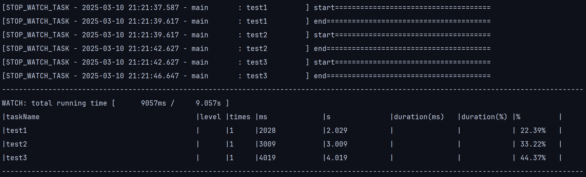
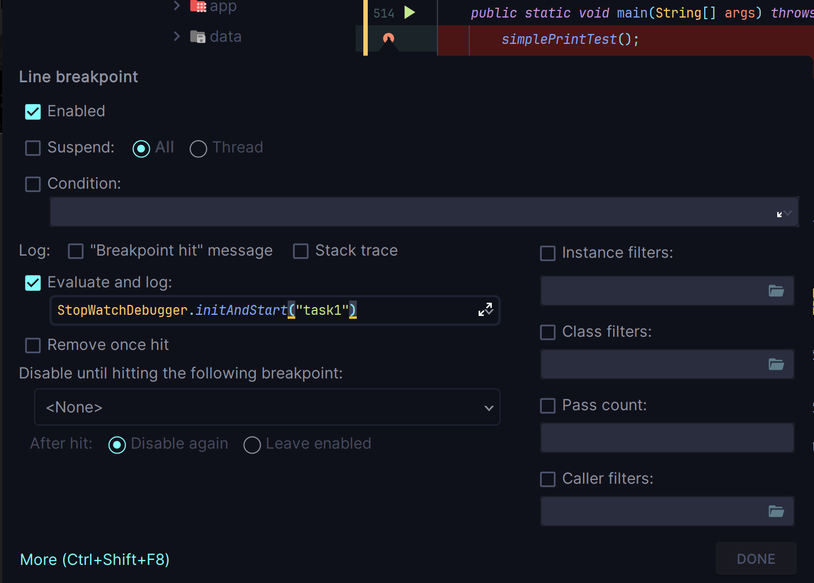

# Table of Contents
- [Introduction](#introduction)
- [Directory Structure](#directory-structure)
  - [docs](#docs)
    - [Algorithms.md](#algorithmsmd)
    - [Env.md](#envmd)
    - [Standards.md](#standardsmd)
  - [Simi Sandbox](#simi-sandbox)
# Introduction
[Back to Top](#table-of-contents) 

Simi is a modular maven project designed to explore various architectural and integration techniques, featuring detailed documentation to help you configure and use it.
# Core Functionality
## StopWatchDebugger
`StopWatchDebugger` is a performance optimization tool that tracks sync and async task execution times without suspending the programe and modifying your original code.

No need to add `System.out.println(System.currentTimeMillis());` anymore! it simplifies time logging for performance testing.

Example output:

### Usage

Copy this class to your project, then add a line breakpoint to execute its methods without suspending the entire program in **IDEA debug mode**.

The `main` method of the `StopWatchDebugger` class contains several usage examples for reference.

The `stopwatch` instance within `StopWatchDebugger` is protected in singleton mode, ensuring correct functionality in a multi-threaded environment for synchronous execution time testing.

# Directory Structure
[Back to Top](#table-of-contents)
## docs
### Algorithms.md
This file contains solutions to various algorithm problems, each with detailed comments, explanations, and illustrative diagrams.  
For more information, check out the [Algorithms File](docs/Algorithms.md).

### Env.md
This file contains details about the local runtime environment.

For more information, check out the [Env File](docs/Env.md).

### Configuration.md
A guide for configuring various server or CI/CD environments.

For more information, check out the [Configuration File](docs/Configuration.md).
### SystemDesign.md
A guild for designing system functionalities and establishing development standards.

For more information, check out the [SystemDesign File](docs/SystemDesign.md).
## AAA 
A resource directory containing startup configuration files needed by other modules.

## scripts
A folder containing bash and batch files required by other modules.
* cpfiles.sh
  - Copy local files to remote server.
* execr.sh
  - Execute a remote bash script with its environment variables.
* simidep.sh 
  - Deploy a jar file to remote server.

## simi-sandbox
The simi-sandbox is a dedicated Maven module designed as a versatile environment for testing, experimenting, and showcasing various code implementations.

### simi-cap  
Simi Cap is a CAP demo application.  
The [Cloud Application Programming Model (CAP)](https://cap.cloud.sap/docs/java/getting-started) is a framework of languages, libraries, and tools for building enterprise-grade services and applications.

## simi-app
Some simple applications that includes specific functionalities.

### simi-initializer-app  
Simi Initializer is an IntelliJ IDEA plugin designed to streamline the initial configuration of Maven projects with complex local setups.  
It automates startup configurations like adjusting certificate file locations, adding local-specific dependencies, and modifying server IP addresses.

### simi-sgz  
Simi Sgz is an automation script module designed for the game <a href="https://sangokushi.qookkagames.jp">Three Kingdoms Tactics<a/>.

## simi-common
Common modules shared by other modules.

## simi-config
Common configuration files for use by other modules.

## simi-custom
Custom modules.

## simi-gateway
Gateway modules.

## simi-parent
A parent module that manages the dependency versions of other modules.