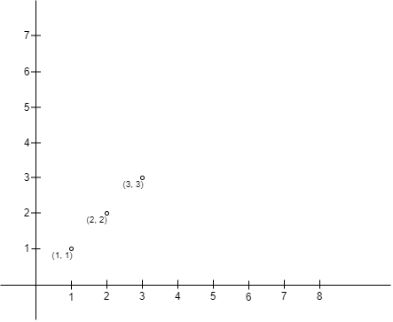
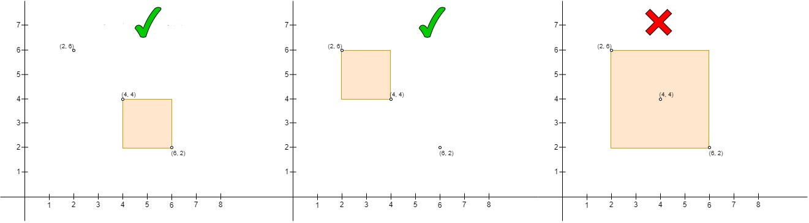
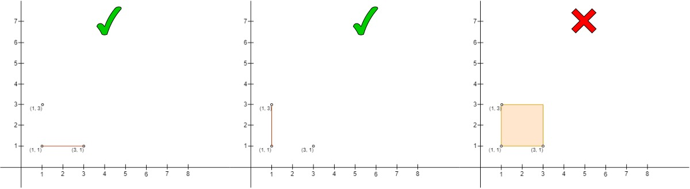
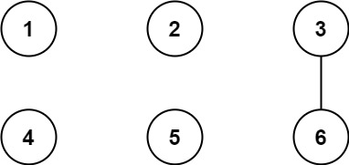
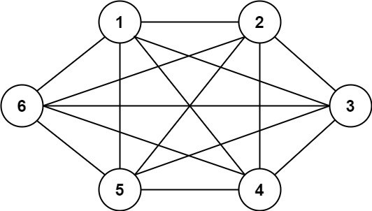
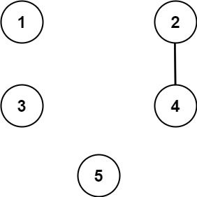

# Table of Contents
[Back to Main Project README](../README.md)
- [Algorithm Problems](#algorithm-problems)
    - Array
        - [1. Array Partition](#1-array-partition)
        - [31. Minimum Number Game](#31-minimum-number-game)
    - Backtracking
        - [29. Power Set LCCI](#29-power-set-lcci)
    - Conditional Logic
        - [2. Add Edges to Make Degrees of All Nodes Even](#2-add-edges-to-make-degrees-of-all-nodes-even)
    - Depth-first Search
        - [3. Amount of Time for Binary Tree to Be Infected](#3-amount-of-time-for-binary-tree-to-be-infected)
        - [29. Power Set LCCI](#29-power-set-lcci)
    - Dichotomy
        - [4. Search in Rotated Sorted Array](#4-search-in-rotated-sorted-array)
    - Difference Array
        - [5. Jump Game VII](#5-jump-game-vii)
    - Dynamic Programming
        - [6. Climbing Stairs](#6-climbing-stairs)
        - [7. Count All Valid Pickup and Delivery Options](#7-count-all-valid-pickup-and-delivery-options)
        - [8. Decode Ways II](#8-decode-ways-ii)
        - [9. Make the XOR of All Segments Equal to Zero](#9-make-the-xor-of-all-segments-equal-to-zero)
        - [10. Maximize Value of Function in a Ball Passing Game](#10-maximize-value-of-function-in-a-ball-passing-game)
        - [11. Minimum Deletions to Make String Balanced](#11-minimum-deletions-to-make-string-balanced)
        - [12. Stone Game](#12-stone-game)
        - [13. Target Sum](#13-target-sum)
    - HashMap
        - [30. Count Common Words With One Occurrence](#30-count-common-words-with-one-occurrence)
    - Fenwick Tree
        - [14. Distribute Elements Into Two Arrays II](#14-distribute-elements-into-two-arrays-ii)
    - Greedy
        - [15. Max Difference You Can Get From Changing an Integer](#15-max-difference-you-can-get-from-changing-an-integer)
        - [16. Maximum Length of Subarray With Positive Product](#16-maximum-length-of-subarray-with-positive-product)
    - Math
        - [17. Construct the Minimum Bitwise Array II](#17-construct-the-minimum-bitwise-array-ii)
        - [18. Egg Drop With 2 Eggs and N Floors](#18-egg-drop-with-2-eggs-and-n-floors)
        - [19. Find Number of Ways to Reach the K-th Stair](#19-find-number-of-ways-to-reach-the-k-th-stair)
        - [20. Minimum Moves to Capture The Queen](#20-minimum-moves-to-capture-the-queen)
    - Precomputation
        - [21. Range Product Queries of Powers](#21-range-product-queries-of-powers)
    - Segment Tree
        - [32. My Calendar II](#32-my-calendar-ii)
    - Sliding Window
        - [22. Find the Longest Equal Subarray](#22-find-the-longest-equal-subarray)
    - String
        - [23. License Key Formatting](#23-license-key-formatting)
    - Traversal
        - [24. Find the Number of Ways to Place People I](#24-find-the-number-of-ways-to-place-people-i)
        - [25. Maximum Number of Operations With the Same Score I](#25-maximum-number-of-operations-with-the-same-score-i)
        - [29. Power Set LCCI](#29-power-set-lcci)
    - Two Pointer
        - [26. Boats to Save People](#26-boats-to-save-people)
        - [27. Find the Lexicographically Largest String From the Box I](#27-find-the-lexicographically-largest-string-from-the-box-i)
        - [28. Merge Sorted Array](#28-merge-sorted-array)
    - Union-Find
        - [33. Graph Connectivity With Threshold](#33-graph-connectivity-with-threshold)
- [SQL Problems](#sql-problems)
    - [1. Odd and Even Transactions](#29-odd-and-even-transactions)
# Algorithm Problems
## 1. Array Partition
[Back to Top](#table-of-contents)  
### Overview
Given an integer array `nums` of `2n` integers, 
group these integers into `n` pairs `(a1, b1), (a2, b2), ..., (an, bn)` such that the sum of `min(ai, bi)` for all `i` is maximized. 
Return the maximized sum.

**Example 1:**
> **Input:** nums = [1,4,3,2]  
> **Output:** 4  
> **Explanation:** All possible pairings (ignoring the ordering of elements) are:
> 1. (1, 4), (2, 3) -> min(1, 4) + min(2, 3) = 1 + 2 = 3
> 2. (1, 3), (2, 4) -> min(1, 3) + min(2, 4) = 1 + 2 = 3
> 3. (1, 2), (3, 4) -> min(1, 2) + min(3, 4) = 1 + 3 = 4
> 
> So the maximum possible sum is 4.

**Example 2:**
> **Input:** nums = [6,2,6,5,1,2]  
> **Output:** 9  
> **Explanation:**   
> The optimal pairing is (2, 1), (2, 5), (6, 6). min(2, 1) + min(2, 5) + min(6, 6) = 1 + 2 + 6 = 9.

**Constraints:**
* `1 <= n <= 10^4`
* `nums.length == 2 * n`
* `-10^4 <= nums[i] <= 10^4`
### Array Solution
In each group, the larger integer will be omitted, and we need to maximize the `sum`.
Therefore, The omitted value must be smaller.
To ensure this, wen can sort the array, so that the smaller integer is omitted when calculating the minimal value from the group.

#### Implementation
```java
class Solution {
    public int arrayPairSum(int[] nums) {
        Arrays.sort(nums);
        int sum=0;
        for(int i=0; i< nums.length; i+=2){
            sum+=nums[i];
        }
        return sum;
    }
}
```
#### Time and Space Complexity
* Time Complexity: $O(n \log n)$
    * `Arrays.sort` has a time complexity of $O(nlogn)$;
    * The loop iterates through the array with a step of 2, so it runs $n/2$ times, resulting a time complexity of $O(n)$.  
    
    Hence, The total time complexity is $O(n \log n)$.
* Space Complexity: $O(logn)$
    * `Arrays.sort` typically requires $O(logn)$ space for sorting a primitive array.  
    
    Therefore, the total space complexity is $O(logn)$.

Note that the space complexity of `Arrays.sort` is:
* $O(logn)$ for sorting primitive arrays.
* $O(n)$ for sorting object arrays.

## 2. Add Edges to Make Degrees of All Nodes Even
[Back to Top](#table-of-contents)
### Overview
There is an **undirected** graph consisting of `n` nodes numbered from `1` to `n`. 
You are given the integer `n` and `a` **2D** array `edges` where `edges[i] = [a_i, b_i]` indicates that there is an edge between nodes `a_i` and `b_i`. The graph can be disconnected.

You can add at most two additional edges (possibly none) to this graph so that there are no repeated edges and no self-loops.

Return `true` if it is possible to make the degree of each node in the graph even, otherwise return `false`.

The degree of a node is the number of edges connected to it.

**Example 1:**  
  
> **Input:** n = 5, edges = [[1,2],[2,3],[3,4],[4,2],[1,4],[2,5]]  
> **Output:** true  
> **Explanation:** The above diagram shows a valid way of adding an edge.
Every node in the resulting graph is connected to an even number of edges.

**Example 2:**  
  
> **Input:** n = 4, edges = [[1,2],[3,4]]  
> **Output:** true  
> **Explanation:** The above diagram shows a valid way of adding two edges.

**Example 3:**  
  
**Input:** n = 4, edges = [[1,2],[1,3],[1,4]]  
**Output:** false  
**Explanation:** It is not possible to obtain a valid graph with adding at most 2 edges.

**Constraints:**
* `3 <= n <= 10^5`
* `2 <= edges.length <= 10^5`
* `edges[i].length == 2`
* `1 <= a_i, b_i <= n`
* `a_i != b_i`
* There are no repeated edges.

### Conditional Logic Solution
To make all node degrees in the graph even by adding only two edges, the following conditions must be met:
* The number of nodes with odd degrees must be even and cannot exceed 4.
    * If there are 4 such nodes, two distinct pairs must exist that can be connected.
    * If there are 2 such nodes, they must either be unconnected, or a third node must exist that can connect to both.
#### Implementation
```java
class Solution {
    public boolean isPossible(int n, List<List<Integer>> edges) {
        Set[] connectedNodes = new Set[n + 1];
        Arrays.setAll(connectedNodes, item -> new HashSet<Integer>());

        // Record all nodes connected to each node
        for (List<Integer> edge : edges) {
            int node1 = edge.get(0), node2 = edge.get(1);
            connectedNodes[node1].add(node2);
            connectedNodes[node2].add(node1);
        }
        List<Integer> nodeWithOddEdges = new ArrayList<Integer>();

        // Identify all nodes with an odd degree
        for (int node = 1; node <= n; ++node){
            if(connectedNodes[node].size()%2>0){
                nodeWithOddEdges.add(node);
                if(nodeWithOddEdges.size()>4)return false;
            }
        }
        int len = nodeWithOddEdges.size();
        if (len == 0) return true;
        if (len == 2) {
            int node1 = nodeWithOddEdges.get(0), node2 = nodeWithOddEdges.get(1);
            // Verify if the two nodes are not connected
            if (!connectedNodes[node1].contains(node2)) return true;

            // Check if there is a third node that can conect to the two nodes
            for (int node = 1; node <= n; ++node){
                if (
                    node != node1 && node != node2 
                    && !connectedNodes[node].contains(node1) && !connectedNodes[node].contains(node2)){
                    return true;
                }
            }
            return false;
        }

        if (len == 4) {
            int a = nodeWithOddEdges.get(0), b = nodeWithOddEdges.get(1), c = nodeWithOddEdges.get(2), d = nodeWithOddEdges.get(3);
            return !connectedNodes[a].contains(b) && !connectedNodes[c].contains(d) ||
                    !connectedNodes[a].contains(c) && !connectedNodes[b].contains(d) ||
                    !connectedNodes[a].contains(d) && !connectedNodes[b].contains(c);
        }
    }
}
```
#### Time and Space Complexity
* Time Complexity: $O(m+n)$  (`m` is the length of array `edges`)
    * `Arrays.setAll`   
    
        Method `Arrays.setAll` takes a time complexiyt of $O(n)$.
    * Record all nodes connected to each node

        The `for` loop has a time complexity of $O(m)$ where `m` is the length of `edges` array.
    * Identify all nodes with an odd degree
        
        The `for` loop takes a time complexiyt of $O(n)$.
    * Check if there is a third node that can conect to the two nodes
        
        The `for` loop takes a time complexiyt of $O(n)$.

    Therefore, the overall time complexity is $O(m+n)$.
* Space Complexity: $O(m+n)$
    * The `connectedNodes` Set array takes $O(m+n)$ space in the worst case, where each node is connected to almost every other node.
    * The `nodeWithOddEdges` array has a size of at most `4`, so its space complexity is constant and can be omitted.

    Thus, the total space complexity is $O(m+n)$.

## 3. Amount of Time for Binary Tree to Be Infected
[Back to Top](#table-of-contents)
### Overview
You are given the `root` of a binary tree with unique values, and an integer `start`. 
At minute `0`, an infection starts from the node with value `start`.

Each minute, a node becomes infected if:
* The node is currently uninfected.
* The node is adjacent to an infected node.
Return the number of minutes needed for the entire tree to be infected.

**Example 1:**


> **Input:** root = [1,5,3,null,4,10,6,9,2], start = 3  
> **Output:** 4  
> **Explanation:** The following nodes are infected during:  
    - Minute 0: Node 3  
    - Minute 1: Nodes 1, 10 and 6  
    - Minute 2: Node 5  
    - Minute 3: Node 4  
    - Minute 4: Nodes 9 and 2  
    It takes 4 minutes for the whole tree to be infected so we return 4.

**Example 2:**


> **Input:** root = [1], start = 1  
> **Output:** 0  
> **Explanation:** At minute 0, the only node in the tree is infected so we return 0.

**Constraints:**
* The number of nodes in the tree is in the range `[1, 10^5]`.
* `1 <= Node.val <= 10^5`
* Each node has a unique value.
* A node with a value of `start` exists in the tree.

### Depth-first Search Solution
The number of minutes required to infect the entire tree corresponds to the longest infection path starting from the node with the value `start`. 

Traverse the tree from the `root` node, defining two variables:
- `pathLen`: Tracks the path length from the current node.
- `pathLenToStart`: Tracks the path length to the node with the value `start`.

For each node, the following cases apply:

- If the current node has the value `start`:

  The answer will be the maximum path length between the left child nodes and the right child nodes.

- If the node with the value `start` is in the left child nodes:

  The answer will be the sum of:
  - The path length from the current node to the start node (`pathLenToStart` of the left child nodes).
  - The deepest path length of the right child nodes.

- If the node with the value `start` is in the right child nodes:

  The answer will be the sum of:
  - The path length from the current node to the start node (`pathLenToStart` of the right child nodes).
  - The deepest path length of the left child nodes.

#### Implementation
```java
class Solution {
    private class Vo {
        public boolean hasStartNode;
        public int pathLen;
        public int pathLenToStart;
        public Vo(Vo vo){
            this.hasStartNode=vo.hasStartNode;
            this.pathLen=vo.pathLen+1;
            this.pathLenToStart=vo.hasStartNode?vo.pathLenToStart:vo.pathLenToStart+1;
        }
        public Vo(boolean hasStartNode, int pathLen, int pathLenToStart){
            this.hasStartNode=hasStartNode;
            this.pathLen=pathLen;
            this.pathLenToStart=pathLenToStart;
        }
    }

    private int ans=0;
    public int amountOfTime(TreeNode root, int start) {
        dfs(root,start,new Vo(false,0,0));
        return this.ans;
    }

    public Vo dfs(TreeNode root, int start, Vo vo) {
        if(root==null){
            --vo.pathLen;
            return vo;
        }
        // Check if the current node has the value 'start'
        if(root.val==start)vo.hasStartNode=true;
        Vo vo1=dfs(root.left, start, new Vo(vo));
        Vo vo2=dfs(root.right, start, new Vo(vo));

        if(root.val==start){
            // If the current node has the value 'start'
            this.ans=Math.max(Math.max(ans, vo1.pathLen-vo.pathLen), vo2.pathLen-vo.pathLen);
        }else if(vo1.hasStartNode){
            // If the node with value 'start' is among the left child nodes
            ans=Math.max(ans, vo1.pathLenToStart-vo.pathLenToStart+vo2.pathLen-vo.pathLen);
        }else if(vo2.hasStartNode){
            // If the node with value 'start' is among the right child nodes
            ans=Math.max(ans, vo1.pathLen-vo.pathLen+vo2.pathLenToStart-vo.pathLenToStart);
        }
        return new Vo(
            vo1.hasStartNode||vo2.hasStartNode, 
            Math.max(vo1.pathLen,vo2.pathLen), 
            vo1.hasStartNode?vo1.pathLenToStart:vo2.pathLenToStart
        );
    }
}
```
#### Time and Space Complexity
- Time Complexity: $O(n)$

    In the worst case, DFS visits all nodes in the tree, leading to a time complexity of $O(n)$, where $n$ is the number of nodes in the tree.

- Space Complexity: $O(n)$
    - Recursion Stack
        
        The DFS traversal uses recursion. In the worst case, the recursion depth can be $O(n)$, leading to a space complexity of $O(n)$ for the recursion stack.

    - Vo Objects
        
        Each node in the tree creates a new Vo object during the DFS. 
        This results in $O(n)$ Vo objects being created, adding to the space complexity.

    - Auxiliary Space
    
        The `ans` variable uses constant extra space.

    Therefore, the overall space complexity of the solution is $O(n)$.
### Optimized Depth-first Search Solution
Instead of creating a `Vo` object in each recursion, 
use a positive path length to indicate that the node with value `start` is in the current path, 
and a negative path length to indicate that the node is not part of the current path.  
This eliminates the need for the `hasStartNode` and `pathLenToStart` variables from the previous solution.  
The logic can be summarized as follows:

- If the current node has the value `start`:

  Reset the path length to `1` and begin accumulating it from the current node.  
  Any previous path length, whether negative or `0`, will be reset to `1`.  
  Recalculate the longest infection path length if either the left or right child tree produces a larger value.

- If the node with the value `start` is in the left child nodes:

  The answer is the sum of:
  - The path length from the current node to the start node (`lLen`).
  - The deepest path length of the right child nodes (`-rLen`).

- If the node with the value `start` is in the right child nodes:

  The answer is the sum of:
  - The path length from the current node to the start node (`rLen`).
  - The deepest path length of the left child nodes (`-lLen`).

The second and third cases can be verified together using `Math.abs`.

#### Implementation
```java
class Solution {
    private int ans;

    public int amountOfTime(TreeNode root, int start) {
        dfs(root, start);
        return ans;
    }

    private int dfs(TreeNode node, int start) {
        if (node == null) {
            return 0;
        }
        int lLen = dfs(node.left, start);
        int rLen = dfs(node.right, start);
        // Check if the current node has the value 'start'
        if (node.val == start) {
            this.ans = -Math.min(lLen, rLen); 
            // Reset the path length upon encountering the node with the value 'start'.
            return 1; 
        }
        if (lLen > 0 || rLen > 0) {
            this.ans = Math.max(ans, Math.abs(lLen) + Math.abs(rLen)); 
            // Accumulate the path length beginning at the node with the value 'start'.
            return Math.max(lLen, rLen) + 1; 
        }
        // The path length is negative if the node with value 'start' is not in the current path.
        return Math.min(lLen, rLen) - 1; 
    }
}
```
#### Time and Space Complexity
- Time Complexity: $O(n)$

    Similar to the previous solution, visiting all nodes in the tree in the worst case results in a time complexity of $O(n)$, where $n$ is the total number of nodes.

- Space Complexity: $O(n)$
    - Recursion Stack
        
        The DFS traversal utilizes recursion. In the worst case, the recursion depth can be $O(n)$, leading to a space complexity of $O(n)$ for the recursion stack.

    - Auxiliary Space
    
        The `ans` variable uses constant extra space.

    Therefore, the overall space complexity of the solution is $O(n)$.

## 4. Search in Rotated Sorted Array
### Overview
There is an integer array `nums` sorted in ascending order (with distinct values).

Prior to being passed to your function, `nums` is **possibly rotated** at an unknown pivot index `k` (`1 <= k < nums.length`) such that the resulting array is `[nums[k], nums[k+1], ..., nums[n-1], nums[0], nums[1], ..., nums[k-1]]` (0-indexed). 
For example, `[0,1,2,4,5,6,7]` might be rotated at pivot index `3` and become `[4,5,6,7,0,1,2]`.

Given the array `nums` after the possible rotation and an integer `target`, return the index of `target` if it is in `nums`, or `-1` if it is not in `nums`.

**Example 1:**
> **Input:** nums = [4,5,6,7,0,1,2], target = 0  
> **Output:** 4

**Example 2:**
> **Input:** nums = [4,5,6,7,0,1,2], target = 3  
> **Output:** -1

**Example 3:**
> **Input:** nums = [1], target = 0  
> **Output:** -1

**Constraints:**
* `1 <= nums.length <= 5000`
* `-10^4 <= nums[i] <= 10^4`
* All values of `nums` are unique.
* `nums` is an ascending array that is possibly rotated.
* `-10^4 <= target <= 10^4`

### Analysis
Since the original array is sorted in ascending order, even if it is rotated, splitting the array into two parts around the central element ensures that one part will always be sorted.  
Define a central element `pivot`.  
In each division, the approach is as follows:

- If the left part is in ascending order:
  - If `target >= nums[left] && target <= nums[pivot]`, search for `target` in the left part.
  - Otherwise, search for `target` in the right part.

- If the right part is in ascending order:
  - If `target >= nums[pivot+1] && target <= nums[right]`, search for `target` in the right part.
  - Otherwise, search for `target` in the left part.

The key is leveraging the guaranteed existence of an ordered segment in each division.

#### Implementation
```java
class Solution {
    public int search(int[] nums, int target) {
        return findTarget(target, nums, 0, nums.length-1);
    }
    private int findTarget(int target, int[] nums, int left, int right){
        int pivot = (left+right)/2;
        if(nums[pivot]==target){
            return pivot;
        }else if(left==right){
            return -1;
        }
        if(nums[pivot] >= nums[left]){
            if(target >= nums[left] && target <= nums[pivot]){
                return findTarget(target, nums, left, pivot);
            }else{
                return findTarget(target, nums, pivot+1, right);
            }
        }else {
            if(target >= nums[pivot+1] && target <= nums[right]){
                return findTarget(target, nums, pivot+1, right);
            }else{
                return findTarget(target, nums, left, pivot);
            }
        }
    }
}
```
#### Time and Space Complexity
* Time Complexity: $O(logn)$

    In each recursive call, the array range is split into **two** approximately equal part, resulting in a total recursion time of $O(logn)$.

* Space Complexity: $O(logn)$

    Each recursive call adds a frame to the recursion stack, with a maximum depth of $O(logn)$, leading to a space complexity of O(logn).

## 5. Jump Game VII
[Back to Top](#table-of-contents)  
### Overview
You are given a 0-indexed binary string `s` and two integers `minJump` and `maxJump`. 
In the beginning, you are standing at index `0`, which is equal to `'0'`. 
You can move from index `i` to index `j` if the following conditions are fulfilled:
* `i + minJump <= j <= min(i + maxJump, s.length - 1)`, and
* `s[j] == '0'`. 

Return true if you can reach index `s.length - 1` in `s`, or `false` otherwise.

**Example 1:**

> **Input:** s = "011010", minJump = 2, maxJump = 3  
> **Output:** true  
> **Explanation:**  
> In the first step, move from index 0 to index 3.   
> In the second step, move from index 3 to index 5.

**Example 2:** 

> **Input:** s = "01101110", minJump = 2, maxJump = 3  
> **Output:** false

**Constraints:** 
* `2 <= s.length <= 10^5`
* `s[i]` is either `'0'` or `'1'`.
* `s[0] == '0'`
* `1 <= minJump <= maxJump < s.length`

### Analysis
The `minJump` and `maxJump` define the reachable range for each index `i` in the string `s`. 
Directly applying dynamic programming or depth-first search to traverse the entire range would result in high time complexity.

### Difference Array Solution
Instead of checking the entire reachable range, use a `diff` array to mark the start(`+1`) and the end(`-1`) of each reachable range.  
Utilize an accumulatable falg `acc` to track the reachable range:
* Increment `acc` by `1` (`acc += 1`) upon entering a range 
* Decrement `acc` by `1` (`acc -= 1`) upon leaving.

Example:
```text
Two non-overlapping reachable areas:
minJump = 3, maxJump = 4
s:      0 1 1 0 1 1 1 1 1 1
              a a   b b
acc:          + -   + -

Two overlapping reachable areas:
minJump = 2, maxJump = 5
s:      0 1 0 1 1 1 1 1 1 1
            a a a a  
                b b b b
acc:        +     -
                +     -
```
In both cases, the `diff` array enables distinguishing whether current index is within a reachable range, even when multiple ranges overlap.
#### Implementation
```java
class Solution {

    public boolean canReach(String s, int minJump, int maxJump) {
        int len = s.length();
        if ( s.charAt(len - 1) == '1' || minJump > len) {
            return false;
        }
        int[] diff = new int[len];
        diff[0] = 1;
        diff[1] = -1;
        int acc = 0;
        // Accumulated prefix sum to track reachability
        for (int i = 0; i < len; i++) {
            acc += diff[i];
            if (acc > 0 && s.charAt(i) == '0') {
                // Mark the start of the reachable range from i + minJump
                if (i + minJump < len) {
                    diff[i + minJump] += 1;
                } 
                // Mark the end of the reachable range after i + maxJump
                if (i + maxJump + 1 < len) {
                    diff[i + maxJump + 1] -= 1;
                }
            }
        }
        return acc > 0;
    }
}
```
#### Time and Space Complexity
* Time Complexity: $O(n)$ 

    The `for` loop iterates over each character in the string `s`, resulting in a time complexity of $O(n)$.
* Space Complexity: $O(n)$

    The `diff` array, which has a size of `len` (the length of the string `s`), 
    contributes $O(n)$ to the space complexity. 
    
    Other variables require constant space, resulting in an overall space complexity of $O(n)$.

### Sliding Window Solution
Maintain a sliding window from `left` to `right` to track the count of indices `nbp` for a specific index `i` as the sliding window moves along the string `s`.  
if  `nbp > 0`, the index `i` is reachable from the sliding window range, otherwise, it is not.  
When the window's length exceeds `maxJump - minJump + 1`, remove the character at the left boundary and update `npb` accordingly.

Example: 
```text
minJump = 3, maxJump = 5

Step 1 (Initialization):
    index: 0 1 2 3 4 5 6 7 8 9 
    s:     0 0 1 1 0 1 0 0 0 0 
           L
           R     i
    nbp = 1
    dp[0] = true
    dp[1] = false (initialized to false by default)
    dp[2] = false (initialized to false by default)
    dp[3] = false

Step 2:
    index: 0 1 2 3 4 5 6 7 8 9 
    s:     0 0 1 1 0 1 0 0 0 0 
           L
             R     i
    nbp = 1
    dp[4] = true

Step 3:
    index: 0 1 2 3 4 5 6 7 8 9 
    s:     0 0 1 1 0 1 0 0 0 0 
           L
               R     i
    nbp = 1
    dp[5] = false

Step 4:
    index: 0 1 2 3 4 5 6 7 8 9 
    s:     0 0 1 1 0 1 0 0 0 0 
             L
                 R     i
    nbp = 0 (decremented by 1 as dp[0] is true and has been excluded)
    dp[6] = false

Step 5:
    index: 0 1 2 3 4 5 6 7 8 9 
    s:     0 0 1 1 0 1 0 0 0 0 
               L
                   R     i
    nbp = 1 (incremented by 1 as dp[4] is true and has been included)
    dp[7] = true

... 

Step n:
    index: 0 1 2 3 4 5 6 7 8 9 
    s:     0 0 1 1 0 1 0 0 0 0 
                   L
                       R     i
    Return dp[9]
```
#### Implementation
```java
class Solution {
    public boolean canReach(String s, int minJump, int maxJump) {
        int len=s.length();
        if (s.charAt(len - 1) == '1') return false;
        boolean[] dp = new boolean[len];
        dp[0] = true;

        int nbp = 1;
        int left = 0;
        int right = 0;
        // Check if indices are reachable from index minJump
        for (int i = minJump; i < len; i++) {
            if (s.charAt(i) == '0') {
                if (nbp > 0) {
                    dp[i] = true;
                }
            }
            // Move the left boundary of the sliding window rightward by 1 when its length reaches `maxJump - minJump + 1`.
            if (right - left + 1 == maxJump - minJump + 1) {
                if (dp[left]) {
                    nbp--;
                }
                left++;
            }
            // Move the right boundary of the sliding window rightward duiring the traversal
            right++;
            if (dp[right]) {
                nbp++;
            }
        }
        return dp[len - 1];
    }
}
```
#### Time and Space Complexity
* Time Complexity: $O(n)$ 
    
    The `for` loop iterates from `minJump` to `len` (the length of the string s), resulting in a time complexity of $O(n)$.

* Space Complexity: $O(n)$

    The `dp` array has a size of len, contributing $O(n)$ to the space complexity.

## 6. Climbing Stairs
[Back to Top](#table-of-contents)  
### Overview
You are climbing a staircase. It takes `n` steps to reach the top.

Each time you can either climb `1` or `2` steps. In how many distinct ways can you climb to the top?

**Example 1:**
> **Input:** n = 2  
> **Output:** 2  
> **Explanation:** There are two ways to climb to the top.
> 1. 1 step + 1 step  
> 2. 2 steps

**Example 2:**
> **Input:** n = 3  
> **Output:** 3  
> **Explanation:** There are three ways to climb to the top.  
> 1. 1 step + 1 step + 1 step  
> 2. 1 step + 2 steps  
> 3. 2 steps + 1 step


**Constraints:**
* `1 <= n <= 45`

### Analysis
Here is a simple example when `n=5`:
```text
stair:            0 1 2 3 4 5 
ways:               1 2 3 5 8
```
Observe the above example, the number of ways to reach stair `n` is the sum of the number of ways to reach stairs `n-1` and `n-2`.
Thus, it follows the Fibonacci sequence.

### Dynamic Programming Solution
Fibonacci sequence formula:
$$ F(n)=F(n-1)+F(n-2) $$
#### Initialization 
The number of ways to reach stair `1` is `1` and stair `2` is `2`, so:  
$$ F(1) = 1,  F(2) = 2 $$
#### Filling the DP Table
Since this process only depends on the previous two stairs, we can just define two variables to store the number of ways for the previous two stairs.
#### Implementation
```java
class Solution {
    public int climbStairs(int n) {
        if(n==1)return 1;
        if(n==2)return 2;
        int pre1=1;
        int pre2=2;
        int current=0;
        // Calculate the number of ways to reach a specific stair.
        for(int i=3;i<=n;i++){
            current=pre1+pre2;
            pre1=pre2;
            pre2=current;
        }
        return current;

    }
}
```
#### Time and Space Complexity
* Time Complexity: $O(n)$

    The `for` loop iterate over the stairs starting from `3`, yielding a time complexity of $O(n)$.
* Space Complexity: $O(1)$
## 7. Count All Valid Pickup and Delivery Options
[Back to Top](#table-of-contents)  
### Overview
Given `n` orders, each order consists of a pickup and a delivery service.

Count all valid pickup/delivery possible sequences such that delivery(i) is always after of pickup(i). 

Since the answer may be too large, return it modulo 10^9 + 7.

**Example 1:**
> **Input:** n = 1  
> **Output:** 1  
> **Explanation:** Unique order (P1, D1), Delivery 1 always is after of Pickup 1.

**Example 2:**
> **Input:** n = 2  
> **Output:** 6  
> **Explanation:** All possible orders:   
(P1,P2,D1,D2), (P1,P2,D2,D1), (P1,D1,P2,D2), (P2,P1,D1,D2), (P2,P1,D2,D1) and (P2,D2,P1,D1).  
This is an invalid order (P1,D2,P2,D1) because Pickup 2 is after of Delivery 2.

**Example 3:**
> **Input:** n = 3  
> **Output:** 90

**Constraints:**
* `1 <= n <= 500`
### Analysis
When `n=2`, the following are all possible combinations:
```text
P1,P2,D1,D2
P1,P2,D2,D1
P2,P1,D1,D2
P2,P1,D2,D1

P1,D1,P2,D2
P2,D2,P1,D1
```

Adding a new `'P'` and `'D'`:
1. Insert `'PD'` Together:

    For example, using `'L'` represents a location and `'<>'` represents a gap location:
    ```text
    <> L <> L <> L <> L <>
    ```
    No matter whether it's `'P'` or `'D'` in the above `'L'` location, the number of valid gap positions (`'<>'`) that can be inserted for `'PD'` is: 
    $$ C(5, 1) $$

2. Insert `'PD'` Separately:
    ```text
    <> L <> L <> L <> L <>
    ```
    Select two valid gap positions from 5 gap positions in a fixed order:
     $$ C(5,2) $$

Define `F(n)` as the number of valid pickup/delivery possible sequences where `'n'` represents the total number of pickups (`'P'`).  
The formula is:
$$F(n)=F(n-1) \times ( C(2(n-1)+1, 1) + C(2(n-1)+1, 2) )$$

$$F(n)=F(n-1) \times ( 2n-1 + \frac{(2n-1) \times (2n-2)}{2} )$$

$$F(n)=F(n-1) \times ( n\times(2n-1) )$$

$$F(n)=F(n-1) \times ( 2n^2-n )$$

The initial condition is: 
$$F(1)=1$$

#### Implementation
```java
class Solution {
    private int MOD=1_000_000_007;
    public int countOrders(int n) {
        long res = 1;
        for (int i = 2; i <= n; i++) {
            res = res * (2*i*i-i) % MOD;
        }
        return (int) res;
    }
}
```
#### Time and Space Complexity
* Time Complexity: $O(n)$

    The `for` loop runs in $O(n)$ time.

* Space Complexity: $O(1)$


## 8. Decode Ways II
[Back to Top](#table-of-contents)  
### Overview
A message containing letters from `A-Z` can be encoded into numbers using the following mapping:
```text
'A' -> "1"
'B' -> "2"
...
'Z' -> "26"
```
To decode an encoded message, all the digits must be grouped then mapped back into letters using the reverse of the mapping above (there may be multiple ways). For example, "11106" can be mapped into:

`"AAJF"` with the grouping `(1 1 10 6)`
`"KJF"` with the grouping `(11 10 6)`
Note that the grouping `(1 11 06)` is invalid because `"06"` cannot be mapped into `'F'` since `"6"` is different from `"06"`.

In addition to the mapping above, an encoded message may contain the `'*'` character, which can represent any digit from '1' to '9' ('0' is excluded). For example, the encoded message "1*" may represent any of the encoded messages `"11"`, `"12"`, `"13"`, `"14"`, `"15"`, `"16"`, `"17"`, `"18"`, or `"19"`. Decoding `"1*"` is equivalent to decoding any of the encoded messages it can represent.

Given a string `s` consisting of digits and `'*'` characters, return the **number** of ways to **decode** it.

Since the answer may be very large, return it **modulo** $ 10^9+7 $.

**Example 1:**
> **Input:** s = "*"  
> **Output:** 9  
> **Explanation:** The encoded message can represent any of the encoded messages "1", "2", "3","4", "5", "6", "7", "8", or "9".  
> Each of these can be decoded to the strings "A", "B", "C", "D", "E", "F", "G", "H", and"I" respectively.  
> Hence, there are a total of 9 ways to decode "*".  

**Example 2:**
> **Input:** s = "1*"  
> **Output:** 18  
> **Explanation:** The encoded message can represent any of the encoded messages "11", "12", "13", "14", "15", "16", "17", "18", or "19".  
> Each of these encoded messages have 2 ways to be decoded (e.g. "11" can be decoded to "AA" or "K").  
> Hence, there are a total of 9 * 2 = 18 ways to decode "1*".

**Example 3:**
> **Input:** s = "2*"  
> **Output:** 15  
> **Explanation:**  
> The encoded message can represent any of the encoded messages "21", "22","23", "24", "25", "26", "27", "28", or "29".  
> "21", "22", "23", "24", "25", and "26" have 2 ways of being decoded, but "27", "28", and"29" only have 1 way.  
> Hence, there are a total of (6 * 2) + (3 * 1) = 12 + 3 = 15 ways to decode "2*".

**Constraints:**
* `1 <= s.length <= 10^5`
* `s[i]` is a digit or `'*'`.
### Analysis
Here is a random example to demonstrate the decode process:
```text
indices: 0 1 2 3 4 5 6 7   
s:       3 2 9 * 8 1 4 2
```
First, The numbers `7, 8, 9` can only be decoded as a single number, 
and the numbers `1-6` can be decoded as a single number or when the previous number is `1` or `2`,
they can be decoded together with the previous number as a new number.
### Dynamic Programming Solution
When determining the number of ways to decode a sequence, we can break it down into two distinct parts for analysis.  

Here is an simple example:
```text
2392576 
```
Divide the number into `2392` and `576`, so the total number of decoding ways is the product of the decoding ways for `2392` and `576`.  

However, There is another case we need to consider:  

When the digit `2` on the left and the digit `5` on the right are decoded as a pair, 
the product of decoding ways for `2392` and `576` alone is insufficient to account for all possible decoding methods.  
Thus, the total number of decoding ways should also **include** the product of the decoding ways for `239` and `25` and `76`.

The DP process below traverses by index, checking one number at a time.  
For example, the process will consider `2392` and `5`. 
The total number of decoding ways should be the sum of the product of decoding ways for `239` and `5`, plus the product of decoding ways for `239` and `25`.

#### Initialization 
Define a one-dimensional array `dp`, where `dp[i]` represents the number of ways to decode the  the string `s` from index `0` to index `i-1`.
The length of the `dp` array is `s.length+1`, providing space to prevent missing the value of `dp[i-2]`.
####  Filling the DP Table  
The dynamic programming equation can be expressed as follows:

Single-digit decoding (current character only):
```text
d1 = 
    dp[i-1],    s[i] = 1-9
    dp[i-1]×9,  s[i] = * 
```
Two-digit decoding (current and previous character together):
```text
d2 = 
    dp[i-2],    s[i] = 7~9 and s[i-1]=1 or *
    0,          s[i] = 7~9 and s[i-1] = 3~9 or 0 or 2
    dp[i-2],    s[i] = 0~6 and s[i-1] = 1 or 2
    dp[i-2]×2,  s[i] = 0~6 and s[i-1] = *
    0,          s[i] = 0~6 and s[i-1] = 3~9 or 0
    dp[i-2]×9,  s[i] = * and s[i-1] = 1 
    dp[i-2]×6,  s[i] = * and s[i-1] = 2
    dp[1-2]*15, s[i] = * and s[i-1] = *
    0,          s[i] = * and s[i-1] = 3~9 or 0
```
```
dp[i] = d1 + d2
```
#### Result
The `dp[len]` is the number of ways to decode the string `s`.

#### Implementation
```java
class Solution {
    static final int MOD = 1000000007;
    public int numDecodings(String s) {
        int len=s.length();
        long[] dp=new long[len+1];
        dp[0]=1;
        // Initialize dp array
        dp[1] = (s.charAt(0) == '*') ? 9 : (s.charAt(0) != '0' ? 1 : 0);
        // Traverse array chars
        // indices:  0 1 2 3 4 5 6
        // dp:     0 1 2 3 4 5 6 7
        for(int i=2; i<len+1; i++){
            // Check the string s starting from index 1
            // Use characters instead of numeric value to prevent confusion
            char val=s.charAt(i-1);
            char pre=s.charAt(i-2);
            // Single-digit decoding (current character only)
            // '0' has no valid encoding as a single digit
            if (val >= '1' && val <= '9') {
                dp[i] += dp[i-1];
            } else if (val == '*') {
                dp[i] += dp[i-1] * 9;
                if(dp[i]>MOD)dp[i]%=MOD;
            }
            // Two-digit decoding (current and previous character together)
            if(val>='7'&&(pre=='1'|| pre=='*')){
                dp[i]+=dp[i-2];
            }else if(val>='0'&&val<='6'){
                if(pre=='1'||pre=='2'){
                    dp[i]+=dp[i-2];
                }else if(pre=='*'){
                    dp[i]+=dp[i-2]*2;
                }
            }else if(val=='*'){
                if(pre=='1'){
                    dp[i]+=dp[i-2]*9;
                }else if(pre=='2'){
                    dp[i]+=dp[i-2]*6;
                }else if(pre=='*'){
                    dp[i]+=dp[i-2]*15;
                }
            }
            if(dp[i]>MOD)dp[i]%=MOD;
        }
        return (int)dp[len];
    }
}
```
#### Time and Space Complexity
* Time Complexity: $O(n)$

    The `for` loop runs from `i=2` to `i=len`, where `len` is the length of the string `s`, resulting in a time complexity of $O(n)$
* Space Complexity: $O(n)$

    The `dp` array is of size `n+1`, where `n` is the length of the string.
    Thus, the overall space complexity is $O(n)$.
#### Consideration
* Calculate the single-digit decoding cases first to avoid redundant calculations.
* The time complexity of `s.toCharArray()` is O(n), while the `s.charAt()` has a time complexity of O(1), making `charAt()` more efficient.
* The values in the `dp` array are taken modulo 10<sup>9</sup> + 7, which is still a very large value. long type is required to prevent integer overflow.
* Using `Character.getNumericValue()` to obtain the nummeric value of `'*'` in string `s` will return `'-1'` and using the `-1` for checking purposes can lead to misleading readability.

## 9. Make the XOR of All Segments Equal to Zero
[Back to Top](#table-of-contents)  
### Overview
You are given an array `nums` and an integer `k`. The `XOR` of a segment `[left, right]` where `left <= right` is the `XOR` of all the elements with indices between `left` and `right`, inclusive: `nums[left] XOR nums[left+1] XOR ... XOR nums[right]`.

Return the minimum number of elements to change in the array such that the `XOR` of all segments of size `k` is equal to zero.

**Example 1:**
> **Input:** nums = [1,2,0,3,0], k = 1  
> **Output:** 3  
> **Explanation:** Modify the array from [1,2,0,3,0] to from [0,0,0,0,0].

**Example 2:**
> **Input:** nums = [3,4,5,2,1,7,3,4,7], k = 3  
> **Output:** 3  
> **Explanation:** Modify the array from [3,4,5,2,1,7,3,4,7] to [3,4,7,3,4,7,3,4,7].

**Example 3:**
> **Input:** nums = [1,2,4,1,2,5,1,2,6], k = 3  
> **Output:** 3  
> **Explanation:** Modify the array from [1,2,4,1,2,5,1,2,6] to [1,2,3,1,2,3,1,2,3].

**Constraints:**
* `1 <= k <= nums.length <= 2000`
* `0 <= nums[i] < 2^10`

### Dynamic Programming Solution
Since the `XOR` result of any segments with a length `k` equals `0`, for index `i`, the following holds:
$$ nums[i] \oplus nums[i+1] \oplus ... \oplus nums[i+k-1] =0 $$
Additionally, another equation applies:
$$ nums[i+1] \oplus nums[i+2] \oplus ... \oplus nums[i+k] =0 $$

The symbol $\oplus$ represents the `XOR` operation. Based on the formula $a \oplus b \oplus b =a$ ,the `XOR` result of the two equations is:  
$$ nums[i] \oplus nums[i+k]=0 $$
The equation is equivalent to:
$$ nums[i]=nums[i+k] $$
The `nums` array needs to satisfy:
$$\forall i \in [0, n-k), nums[i] = nums[i+k]$$
* $\forall$  

    This symbol represents "for all" and is rendered as the universal quantifier in LaTeX.
* $i \in [0, n-k)$

    This denotes that `'i'` is an element of the set of integers from `0` to `n-k` (inclusive of `0` but exclusive of `n-k`).  
    The symbol $\in$ in LaTeX represents "element of" or "belongs to".

Divide the array `nums` into `k` groups, the **m-th** group contains all elements where the index `i` satisfies `i % k = m`.
The elements in each group must be exactly identical after their values are modified.

Define a two-dimensional array `dp` where`dp[m][x]` represents maximum number of elements that can be kept **unchanged** in the first `m` groups to achieve a `XOR` result of `x`.

Assuming there is an element `x` in group `m` with a count of `count[m][x]`, and the `XOR` result of the retainted elements from the previous groups is `o`, then:
<!-- dp[m][o ^ x] = Math.max(dp[m][o ^ x], dp[m - 1][o] + count); -->
$$
dp[m][x] = 
\begin{cases} 
    count[0][x] & m = 0 \\
    \max(dp[m][o \oplus x], dp[m-1][o] + count[m][x]),   & m > 0
\end{cases}
$$
Below is a detailed explanation of the dynamic programming (DP) formula:
* If `m=0`, retain the current `x` without changes.
* If `m>0`, retain the current `x` and add its count, `count[m][x]`.

    However, if the current group `m` contains a greater number of another retained element matching the $o \oplus x$ result, skip the current `x` since the goal is to preserve as many elements as possible.
* A general solution for all scenarios is to retain the element with the highest frequency in each group while modifying only the element with the lowest frequency to match the `XOR` result of the other groups.   
    If this approach results in a greater number of retained elements, use it as the final solution.

Example: 

```text
nums =  [3,4,5,2,1,7,3,4,7]
indices: 0 1 2 3 4 5 6 7 8
k = 3

Elements in Group 0:
  3,2,3
Elements in Group 1:
  4,1,4
Elements in Group 2:
  5,7,7
```
Traverse all possible `XOR` results from the previous group, as each element might be retained.
```text
nums =  [3,4,5,2,1,7,3,4,7]
indices: 0 1 2 3 4 5 6 7 8
k = 3

Elements in Group 0:
  3,2,3
Elements in Group 1:
  4,1,4
Elements in Group 2:
  5,7,7

Step 1:
    dp[0][3] = 2 (keep 3 unchanged)
    dp[0][2] = 1 (keep 2 unchanged)
Step 2:
    dp[1][0^4] = Math.max( dp[1][0^4], dp[0][0]+2 )  (skip 4 or keep 4 unchanged)
    dp[1][1^4] = Math.max( dp[1][1^4], dp[0][1]+2 )  
    dp[1][2^4] = Math.max( dp[1][2^4], dp[0][2]+2 )
    dp[1][3^4] = Math.max( dp[1][3^4], dp[0][3]+2 )
    ...
    dp[1][1024^4] = Math.max( dp[1][1024^4], dp[0][1024]+2 )

    dp[1][0^1] = Math.max( dp[1][0^1], dp[0][0]+1 )  (skip 1 or keep 1 unchanged)
    dp[1][1^1] = Math.max( dp[1][1^1], dp[0][1]+1 )  
    dp[1][2^1] = Math.max( dp[1][2^1], dp[0][2]+1 )
    dp[1][3^1] = Math.max( dp[1][3^1], dp[0][3]+1 )
    ...
    dp[1][1024^4] = Math.max( dp[1][1024^4], dp[0][1024]+2 )
...
```
In the previous analysis , we defined `o` as the `XOR` result of the retainted elements from the previous groups.  
For the example above, The final modified array is `[3,4,7,3,4,7,3,4,7]`, the valid `o` values across all possible `XOR` results at each step will be:
$$o_0 = 3 \\ o_1=3 \oplus 4 = 7 \\ o_2=3 \oplus 4 \oplus 7 =0 $$

Assuming the approach of retaining the element with the highest frequency in each group while modifying only the element with the lowest frequency yields a retained element count of `rnum`.

The maximum number of elements retained in the array `nums` to satisfy the problem's requirements is:
$$ nums.length - Math.max(rnum, dp[k - 1][0]) $$

#### Implementation
```java
class Solution {
    public int minChanges(int[] nums, int k) {
        int maxVal = 1024;

        // Create a HashMap for each group to store the frequency of each element
        Map<Integer, Integer>[] maps = new Map[k];
        for (int i = 0; i < nums.length; i++) {
            int mod = i % k;
            if (maps[mod] == null) {
                maps[mod] = new HashMap<>();
            }
            maps[mod].put(nums[i], maps[mod].getOrDefault(nums[i], 0) + 1);
        }

        // The minimum frenquency of elements in each group
        int min = Integer.MAX_VALUE / 2;
        int rnum = 0;
        // Traverse the divided groups
        for (int m = 0; m < k; m++) {
            Map<Integer, Integer> map = maps[m];
            // The maximum frequency of elements in the current group
            int maxFreq = 0;
            // The number of distinct elements in the current group
            int count = 0;
            for (int freq : map.values()) {
                maxFreq = Math.max(freq, maxFreq);
                count += freq;
            }
            rnum += maxFreq;
            min = Math.min(min, maxFreq);
        }
        rnum -= min;
        int[][] dp = new int[k][maxVal];

        // Initialize the DP state
        for (Map.Entry<Integer, Integer> e : maps[0].entrySet()) {
            dp[0][e.getKey()] = e.getValue();
        }

        // Traverse the frequency of elements in each group, starting from group `1`
        for (int m = 1; m < k; m++) {
            for (Map.Entry<Integer, Integer> e : maps[m].entrySet()) {
                // The current element
                int x = e.getKey();
                // The frequency of the current element
                int count = e.getValue();
                // Traverse all possible values
                for (int o = 0; o < maxVal; o++) {
                    dp[m][o ^ x] = Math.max(dp[m][o ^ x], dp[m - 1][o] + count);
                }
            }
        }
        return nums.length - Math.max(rnum, dp[k - 1][0]);
    }
}
```
#### Time and Space Complexity
* Time Complexity: $O(n)$

    * Create a HashMap for each group to store the frequency of each element  
    
        This loop iterates over all elements in array `nums` , resulting in a time compleixty of $O(n)$ where `n` represents the length of array `nums`.
    * Traverse the divided groups  
    
        The outer loop iterates through the `k` groups, and the inner loop traverses all unique elements within each group.  
        Let $d_m$ denote the number of distinct elements in group `m`.
        The total cost for traversing across all groups is approximately:
        $$O(\sum_k^{m-1}{d_m})$$

        Given that $\sum{d_m} \approx n$, the time complexity for this loop simplifies to $O(n)$.
    * Initialize the DP state  
    
        This loop iterates over all unique elements in each group, in the worst case, it runs in a $O(n)$ time.
    * Traverse the frequency of elements in each group, starting from group `1`

        - The outer loop runs `k` times (for each group).  
        - The first inner loop iterates over the distinct elements in the current group.
        - The second inner loop iterates over all possible values (bounded by `maxVal` = 1024).
        
        The total time complexity is $O(\sum_k^{m-1}{d_m} \times 1024 )$, where $d_m$ denote the number of distinct elements in group `m`, simplifing to $O(n)$ since $\sum{d_m} \approx n$.

    Therefore, the overall time complexity is $O(n)$.
* Space Complexity: $O(n+k)$
    * `maps` array
        Stores `k` HashMaps, each with up to `n/k` entries on average where `n` represents the length of array `nums`,
        taking $O(n)$ space.
    * `dp` array
    
        A 2D array of size $k \times 1024$, requiring $O(k)$ space.
    * Other variables:
        Includes variables like sum, min, and loop variables. These require $O(1)$ space.

## 10. Maximize Value of Function in a Ball Passing Game
[Back to Top](#table-of-contents)  
### Overview
You are given an integer array `receiver` of length `n` and an integer `k`. 
`n` players are playing a ball-passing game.

You choose the starting player, `i`. The game proceeds as follows:   

player `i` passes the ball to player `receiver[i]`, who then passes it to `receiver[receiver[i]]`, 
and so on, for `k` passes in total. The game's score is the sum of the indices of the players who touched the ball, 
including repetitions, i.e. `i + receiver[i] + receiver[receiver[i]] + ... + receiver(k)[i]`.

Return the `maximum` possible score.

**Notes:**
* `receiver` may contain duplicates.

* `receiver[i]` may be equal to `i`.


**Example 1:**
> **Input:** `receiver = [2, 0, 1]`, `k = 4`  
> **Output:** `6`  
> **Explanation:**  
> Starting with player `i = 2`, the initial score is `2`.
> | Pass | Sender Index | Receiver Index | Score |
> |------|--------------|----------------|-------|
> | 1    | 2            | 1              | 3     |
> | 2    | 1            | 0              | 3     |
> | 3    | 0            | 2              | 5     |
> | 4    | 2            | 1              | 6     |

**Example 2:**
> **Input:** `receiver = [1, 1, 1, 2, 3]`, `k = 3`  
> **Output:** `10`  
> **Explanation:**  
> Starting with player `i = 4`, the initial score is `4`.  
> | Pass | Sender Index | Receiver Index | Score |
> |------|--------------|----------------|-------|
> | 1    | 4            | 3              | 7     |
> | 2    | 3            | 2              | 9     |
> | 3    | 2            | 1              | 10    |

**Constraints:**
* `1 <= receiver.length == n <= 10^5`

* `0 <= receiver[i] <= n - 1`

* `1 <= k <= 10^10`
### Analysis
Using simple enumeration, we can calculate the sum at each index and compare them to determine the maximum sum.  
However, calculating for each index involves a significant amount of repeat computation, resulting in very low performance, we need to minimize the number of passes and avoid redundant calculations.
### Dynamic Programming Solution

Define a two-dimensional array `pa[i][x]` to store the receiver value `x` reached from the initial receiver after $ 2^i $ passings.
Initially, `pa[0][x]` is simply the direct receiver of `x`. 

Similarly, define a two-dimensional array `sum[i][x]` to store the cumulative sum of receiver values when making $ 2^i $ passings from receiver `x`.   
`sum[0][x]` is simply the receiver value at `receiver[x]`, as it represents a single passing.

We can pass the ball to a distant receiver by skipping $ 2^n $ passings, 
instead of passing to the next receiver, as we have stored the cumulative sums for each passing from from each receiver.

#### Precomputation Process
Since each passing distance doubles the previous one,
the current receiver can be determined based on the previously calculated results for the current passing distance.
```text
[1, 2, 3, 4, 5, 6, 7, 8, 9, 10, 0]  
 1       ->  5    ->     9
 1                ->     9
```
We can determine the receiver as follows:  
Receiver `5` is reached after $2^2$ passes from receiver `1`.  
Receiver `9` is reached after $2^2$ passes from receiver `5`.  
Receiver `9` is also reached after $2^3$ passes from receiver `1`.

Here is a simple example to demonstrate the Precomputation process:
```text
receivers:  [1,2,3,4,5,6,7,8,9,10,0]  

Step 1:  
pa[0][1] = 2
pa[0][2] = 3
pa[0][3] = 4
pa[0][4] = 5
...

Step 2: 
pa[1][1] = pa[0][ pa[0][1] ]  = pa[0][2] = 3
pa[1][2] = pa[0][ pa[0][2] ]  = pa[0][3] = 4
pa[1][3] = pa[0][ pa[0][3] ]  = pa[0][4] = 5
...

Step 3: 
pa[2][1] = pa[1][ pa[1][1] ]  = pa[1][3] = 5
...
```
Since `pa[i][x]` represents the receiver after $2^i$ passes from receiver `x`, we can substitute this into the calculation for `pa[i+1][x]`:
$$ pa[i+1][x]=pa[i][pa[i][x]] $$

This relation allows us to efficiently compute the receiver after $2^{i+1}$ passes using previously calculated results.

As initialization, we can directly determine the receiver for each element after $2^0$ pass, which represents the immediate next receiver in a single pass.
#### Passing Process
Using bitwise operations can significantly improve the efficiency of the passing process:
* `k & k -1`  

    The operation clears the rightmost set bit (1) in the binary representation of k.
    
    It can result in:
    * Clearing the rightmost set bit (1) in the binary representation of `k`.  

        The operation `k & k -1` is equivalent to subtracting $2^n$ from `k`, where $n$ is the position of the rightmost set bit.
        For example, when comparing `24` and `12`, the number subtracted from `24` is greater than the number subtracted from `12`, because the rightmost set bit in `24` is further to the left than in `12`.

    * Clearing all bits when `k` is a power of two (like `8`, `16`, `32`, etc.)  

        When `k` is a power of two, `k & k -1` will return `0`.
    
    Example 1:  
    * $ k = 13 $ (binary: `1101`)
    * $ k-1=12 $ (binary: `1100`) 
    * `k & k-1` = `1101 & 1100 = 1100 ` = `12`

    Example 2:  
    * $ k = 24  $ (binary: `11000`)  
    * $ k-1=23 $ (binary: `10111`)  
    * `k & k-1` = `11000 & 10011 = 10000 ` = `16`

   Example 3:  
    * $ k = 12 $ (binary: `1100`)
    * $ k-1=11 $ (binary: `1011`) 
    * `k & k-1` = `1100 & 1011 = 1000 ` = `8`

    Example 4:
    * $ k = 8 $ (binary: `1000`)
    * $ k-1=7 $ (binary: `0111`) 
    * `k & k-1` = `1000 & 0111 = 0000 ` = `0`

* `64 - Long.numberOfLeadingZeros(k)`

    Java `long` values are represented using `64` bits.
    By subtracting the number of leading zeros from `64`,
    we determine the number of bits required to represent `k` in binary (its bit length),
    which also serves as **the exponent** of the power of two closest to k.

* `Long.numberOfTrailingZeros(k)`

    Count the trailing zeros of `k`, which corresponds to the exponent of the number $2^n$  substracted from `k` after the oprations `k &= k-1`.

#### Implementation
```java
class Solution {
    public long getMaxFunctionValue(List<Integer> receiver, long K) {
        int len = receiver.size();
        // The number of passes, which corresponds to the exponent of the power of 2 closest to k.
        int passCount = 64 - Long.numberOfLeadingZeros(K); 
        var pa = new int[passCount][len];
        var sum = new long[passCount][len];
        // Populate the direct receivers
        for (int i = 0; i < len; i++) {
            pa[0][i] = receiver.get(i);
            sum[0][i] = receiver.get(i);
        }
        // Precompute the sum starting from each index incrementally, step by step.
        for (int i = 0; i < passCount - 1; i++) {
            // Traverse receivers
            for (int x = 0; x < len; x++) {
                //  Get the receiver reached after 2^i passes from receiver x
                int p = pa[i][x];
                //  Get the receiver reached after 2^i passes from receiver p
                pa[i + 1][x] = pa[i][p];
                sum[i + 1][x] = sum[i][x] + sum[i][p];
            }
        }
        long ans = 0;
        // Pass the ball
        for (int i = 0; i < len; i++) {
            long s = i;
            int x = i;
            for (long k = K; k > 0; k &= k - 1) {
                // Count trailing zero
                int ctz = Long.numberOfTrailingZeros(k);
                s += sum[ctz][x];
                x = pa[ctz][x];
            }
            ans = Math.max(ans, s);
        }
        return ans;
    }
}
```
#### Time and Space Complexity
* Time Complexity: $O(n \log k)$
    * Precomputation

        The outer loop takes $O(log k)$ time, as it calcualtes the powers of 2 up to $k$.
        The inner loop iterates $O(n)$ times for each outer loop iteration, calculating the receiver and sum for each index, where `n` is the length of the receiver array.

        So, the precomputation step takes $O(n \times log k)$ time.
    * Pass the ball  
        The outer loop iterates $O(n)$ times to consider each starting index.

        The inner loop iterates at most $O(log k)$ times to calculate the final sum for each starting index, using the precomputed values.

    Therefore, the overall time complexity of the algorithm is $O(n \log k)$

* Space Complexity: $O(n \log k)$
    * `pa` and `sum` arrays 
        
        These two arrays store information for each power of `2` up to `k`, and each entry in the array corresponds to a receiver, So the space complexity of these arrays is $O(n \log k)$.

    * Other variables
        
        The other variables, such as `len`, `passCount`, `i`, `x`, `k`, `ctz`, `s`, and `ans`, require constant extra space.
## 11. Minimum Deletions to Make String Balanced
[Back to Top](#table-of-contents)  
You are given a string `s` consisting only of characters `'a'` and `'b'`.

You can delete any number of characters in `s` to make `s` **balanced**. `s` is **balanced** if there is no pair of indices `(i,j)` such that `i < j` and `s[i] = 'b'` and `s[j]= 'a'`.

Return the **minimum** number of deletions needed to make `s` **balanced**.


**Example 1:**
> **Input:** s = "aababbab"  
> **Output:** 2  
> **Explanation:** You can either:  
Delete the characters at 0-indexed positions 2 and 6 ("aababbab" -> "aaabbb"), or  
Delete the characters at 0-indexed positions 3 and 6 ("aababbab" -> "aabbbb").

**Example 2:**
> **Input:** s = "bbaaaaabb"  
> **Output:** 2  
> **Explanation:** The only solution is to delete the first two characters.

**Constraints:**
* 1 <= s.length <= 10^5
* `s[i]` is `'a'` or `'b'`.

### Dynamic Programming Solution
Define `f[i]` to represent the minimum deletions required for the first `i` characters of the string `s`. As we traverse the string `s`, the logic is as follows:

- If the current character is `'b'`, there is no need to delete it.
- If the current character is `'a'`:
  - Deleting it results in `f[i] = f[i-1] + 1`, as the current character is removed.
  - Keeping it requires deleting all `'b'` before the current `'a'`.

Introduce a variable `countB` to represent the number of `'b'` characters encountered in the first `i` characters of the string `s`. 
The dynamic programming formula will be:
```text
f[i] = 
    f[i-1],                   if the current character is 'b'
    min(f[i-1] + 1, countB),  if the current character is 'a'
```
#### Implementation
```java
class Solution {
    public int minimumDeletions(String s) {
        int f = 0, countB = 0;
        for (char c: s.charArray())
            if (c == 'b'){
                ++countB; 
            } else {
                f = Math.min(f + 1, countB);
            }
        return f;
    }
}
```
#### Time and Space Complexity
* Time Complexity: $O(n)$

    The `for` loop takes $O(n)$ time.
* Space Complexity: $O(1)$

## 12. Stone Game
[Back to Top](#table-of-contents)
### Overview
Alice and Bob play a game with piles of stones.
There are an even number of piles arranged in a row, and each pile has a positive integer number of stones `piles[i]`.

The objective of the game is to end with the most stones. The **total** number of stones across all the piles is **odd**,
so there are no ties.

Alice and Bob take turns, with Alice starting first. Each turn, a player takes the entire pile of stones either
from the beginning or from the end of the row. This continues until there are no more piles left,
at which point the person with the most stones wins.

Assuming Alice and Bob play optimally, return true if Alice wins the game, or false if Bob wins.

**Example 1:**
> **Input:** piles = [5,3,4,5]  
> **Output:** true  
> **Explanation:**  
    Alice starts first, and can only take the first 5 or the last 5.  
    Say she takes the first 5, so that the row becomes [3, 4, 5].  
    If Bob takes 3, then the board is [4, 5], and Alice takes 5 to win with 10 points.  
    If Bob takes the last 5, then the board is [3, 4], and Alice takes 4 to win with 9 points.  
    This demonstrated that taking the first 5 was a winning move for Alice, so we return true.

**Example 2:** 
> **Input:** piles = [3,7,2,3]  
> **Output:** true

**Constraints:**
* `2 <= piles.length <= 500`
* `piles.length` is even.
* `1 <= piles[i] <= 500`
* `sum(piles[i])` is odd.
### Depth-first Search Solution
Recursively evaluate the `piles` array from both the start and end,
using a flag variable `isAliceTurn` to track whose turn it is and only calculate the sum for Alice.  
Since the game ends when one player takes more than half of the total stones,
the recursion can terminate early, ensuring only one player wins.
```java
class Solution {
  public boolean stoneGame(int[] piles) {
    int sum = Arrays.stream(piles).sum();
    return dfs(piles, (double)sum/2, 0, piles.length-1,0,true);
  }

  /**
   * Recursive DFS function to determine if Alice can win.
   * 
   * @param piles           The array of stone piles.
   * @param hsum            Half of the total sum of stones (the target for Alice to win).
   * @param left            The current left index of the pile range.    
   * @param right           The current right index of the pile range.
   * @param aliceSum        The current sum of stones collected by Alice.
   * @param isAliceTurn     A boolean indicating whether it is Alice's turn.
   * @return                True if Alice can win, otherwise false.
   */
  private boolean dfs(int[] piles, double hsum, int left, int right, int aliceSum, boolean isAliceTurn){
    // If Alice's current sum exceeds half of the total sum, she wins.
    if(aliceSum>hsum)return true;
    if(left >= right)return false;
    if(piles[left]>piles[right]){
      return dfs(piles, hsum, left+1, right, aliceSum+piles[left], !isAliceTurn);
    }else if(piles[left]<piles[right]){
      return dfs(piles, hsum, left, right-1, aliceSum+piles[right], !isAliceTurn);
    }else{
      return dfs(piles, hsum, left+1, right, aliceSum+piles[left], !isAliceTurn) || dfs(piles, hsum, left, right-1, aliceSum+piles[right], !isAliceTurn);
    }
  }
}
```
#### Time and Space Complexity
* Time Complexity: $O(2^n)$

    Alice and Bob can make two possible choices at each step, and the total number of choices is `right-left`,
    Therefore, the overall time complexity is $O(2^n)$.
    
* Space Complexity: $O(n)$ 

    The depth of the recursive call stack is `right-left`, representing the number of choices for Alice and Bob,
    resulting in a total space complexity of $O(n)$.


### Dynamic Programming Solution
#### Initialization  
Define a two-dimensional array `dp`, where both the rows and columns correspond to the indices of the array `piles`.  
The `dp[i][j]` represents the difference between the number of stones Alice has and the number of stones Bob has, when considering the subarray from index `i` to `j` of the piles array.  
When `i` equals `j`, there is only a single pile of stones, which is `piles[i]`.
Since Alice goes first, she takes this pile, so `dp[i][j]=piles[i]`.
####  Filling the DP Table  
The dynamic programming equation can be expressed as follows:
```text
dp[i][j] = 
    piles[i] - dp[i+1][j],         If the current player picks the pile at index i.
    piles[j] - dp[i][j - 1],       If the current player picks the pile at index j.
```
The negative sign in `"- dp[i+1][j]"` and `"- dp[i][j - 1]"`  is used to reverse the difference in the number of stones between the players when the turn changes.  
Since both players play optimally, the current player will choose the pile with the most stones.  
The equation will be:
```text
dp[i][j] = Math.max(piles[i] - dp[i+1][j], piles[j] - dp[i][j - 1])
```
Fill the DP table in a bottom-up matter.
The current problem (i, j) depends on the results of (i + 1, j) and (i, j - 1).   
By filling the table from the smallest subproblems to larger subproblems (from the end towards the start for i), 
we ensure that `dp[i + 1][j]` and `dp[i][j - 1]` are already computed when needed.  
Here is a random example:
```text
piles = 1 4 5 2 3 8 7 9 2 3
sum = 44
```

```text
indices:  0 1 2 3 4 5 6 7 8 9 
piles:    1 4 5 2 3 8 7 9 2 3

Step 1:
dp[0][0] = 1 
dp[1][1] = 4
...
dp[9][9] = 3


Step 2: 
dp[8][9] = Math.max( 2 - dp[9][9], 3 - dp[8][8] )

Step 3:
dp[7][8] = Math.max( 9 - dp[8][8], 2 - dp[7][7] ) 
dp[7][9] = Math.max( 9 - dp[8][9], 3 - dp[7][8] )

Step 4:
dp[6][7] = Math.max( 7 - dp[7][7], 9 - dp[6][6] ) 
dp[6][8] = Math.max( 7 - dp[7][8], 2 - dp[6][7] ) 
dp[6][9] = Math.max( 7 - dp[7][9], 3 - dp[6][8] ) 
...
```
####  Result  
The result is determined based on whether the score difference for the entire array (`dp[0][length - 1]`) is positive, indicating that the first player Alice can secure a win.

Here is the solution:
```java
class Solution {
    public boolean stoneGame(int[] piles) {
        int length = piles.length;
        int[][] dp = new int[length][length];
        for (int i = 0; i < length; i++) {
            dp[i][i] = piles[i];
        }
        // Fill the DP table in a bottom-up matter. 
        for (int i = length - 2; i >= 0; i--) {
            for (int j = i + 1; j < length; j++) {
                dp[i][j] = Math.max(piles[i] - dp[i + 1][j], piles[j] - dp[i][j - 1]);
            }
        }
        return dp[0][length - 1] > 0;
    }
}
```
#### Time and Space Complexity
* Time Complexity: $O(n^2)$ 

    The sum of iterations for both loop is:  
    $$ 1+2+3+...+(n-1) = \frac{(n-1) \times n}{2} =  O(n^2)$$
* Space Complexity: $O(n^2)$ 

    The algorithm uses a two-dimensional array `dp` of size `n×n`, where `n` is the length of the input array `piles`.
    The space required for this array is $O(n^2)$ .
### Optimized Dynamic Programming Solution
The computation of each cell `dp[i][j]` only depends on values from the current row `i` and the next row `i + 1`,
Thus, We can reuse values in a single one-dimensional array.
```java
class Solution {
    public boolean stoneGame(int[] piles) {
        int length = piles.length;
        int[] dp = new int[length];
        System.arraycopy(piles, 0, dp, 0, length);
        for (int i = length - 2; i >= 0; i--) {
            for (int j = i + 1; j < length; j++) {
                dp[j] = Math.max(piles[i] - dp[j], piles[j] - dp[j - 1]);
            }
        }
        return dp[length - 1] > 0;
    }
}
```
#### Time and Space Complexity
* Time Complexity: $O(n^2)$ 

    The sum of iterations for both loop is:  
    $$ 1+2+3+...+(n-1) = \frac{(n-1) \times n}{2} =  O(n^2)$$
* Space Complexity: $O(n)$  

    The size of one-dimensional array `dp` is `n`, corresponding to the length of the input array.
    The space requried for this array is $O(n)$.

## 13. Target Sum
[Back to Top](#table-of-contents) 
### Overview
You are given an integer array `nums` and an integer `target`.  
You want to build an expression out of nums by adding one of the symbols `'+'` and `'-'` 
before each integer in nums and then concatenate all the integers.

+ For example, if `nums = [2, 1]`, you can add a `'+'` before `2` and a `'-'` before `1` and concatenate 
them to build the expression `"+2-1"`.
+ Return the number of different expressions that you can build, which evaluates to target.

**Example 1:**  
> **Input:** nums = [1,1,1,1,1], target = 3  
> **Output:** 5  
> **Explanation:**  
    There are 5 ways to assign symbols to make the sum of nums be target 3.  
    -1 + 1 + 1 + 1 + 1 = 3  
    +1 - 1 + 1 + 1 + 1 = 3  
    +1 + 1 - 1 + 1 + 1 = 3  
    +1 + 1 + 1 - 1 + 1 = 3  
    +1 + 1 + 1 + 1 - 1 = 3  

**Example 2:**
> **Input:** nums = [1], target = 1  
> **Output:** 1

**Constraints:**
* `1 <= nums.length <= 20`
* `0 <= nums[i] <= 1000`
* `0 <= sum(nums[i]) <= 1000`
* `-1000 <= target <= 1000`
### Depth-first Search Solution
Each element of the array nums can be added either a `+` or `-` sign, 
resulting in `2` choices per element and a total of $2^n$ combinations for `n` elements.  
Use depth-first search to iterate over each combination and maintain a counter `targetSum` shared in each search path 
to count the total number of valid paths that achieve the target sum.

```java
public class Solution {
    private int targetSum=0;
    public int findTargetSumWays(int[] nums, int target) {
        this.dfs(nums, target, 0, 0);
        return this.targetSum;
    }

    /**
     * Find a valid path in which the sum of numbers in the array nums equals the target value.
     *
     * @param nums     Source array
     * @param target   Target sum
     * @param index    Current index
     */
    public void dfs(int[] nums, int target, int index, int sum){
        if(index>=nums.length) {
            if(sum==target)this.targetSum++;
            return;
        }
        dfs(nums, target, index+1, sum+nums[index]);
        dfs(nums, target, index+1, sum-nums[index]);
    }
}
```
#### Time and Space Complexity
* Time Complexity: $O(2^n)$ 

    The total number of recursive calls is proportional to $2^n$, 
    as each element can either contribute positively or negatively to the sum.
* Space Complexity: $O(n)$ (for the recursion stack)
### Optimized Depth-first Search Solution
Define the sum of the elements of the array `nums` as `sum`, the sum of the elements with a `-` sign is `neg`.  
According to the conditions, we can get the following expression:   
`(sum − neg) − neg = target`

Using the above expression, we can directly search for the sum of negative numbers, `neg`.
If the sum of numbers exceed `neg`, this case can be ignored,
unlike the initial solution, where each DFS path must be fully traversed.  

Here’s an example that uses the above expression:
```text
nums = 7 9 8 3 4 5 4 1 9 2 8 7  
sum = 67  
target =  67 + (- 8 - 4 -5 - 1 - 2 - 7)*2 = 13  
neg = (- 8 - 4 -5 - 1 - 2 - 7) = 27
```
The initial solution can be optimized as follows:
#### Implementation
```java
public class Solution {
    public int findTargetSumWays(int[] nums, int target) {
        // Calculate the sum of nums.
        int sum = 0;
        for (int num : nums) {
            sum += num;
        }
        // Check whether the sum can be greater than the target.
        int diff = sum - target;
        if (diff < 0 || diff % 2 != 0) {
            return 0;
        }
        int neg = diff / 2;
        // Calculate the sum of all negative numbers in the array nums (0 <= sum(nums[i]) <= 1000).
        // Use a map to store results for memoization
        Map<String, Integer> memo = new HashMap<>();

        // Start DFS with memoization
        return dfs(nums, neg, nums.length - 1, memo);
    }

    /**
     * Helper DFS method with memoization to count subsets summing to 'neg'.
     *
     * @param nums   The source array.
     * @param neg    The current target for the negative sum.
     * @param index  The current index in the array.
     * @param memo   The memoization map.
     * @return The number of ways to achieve the target neg sum.
     */
    private int dfs(int[] nums, int neg, int index, Map<String, Integer> memo) {
        // Base cases
        if (neg == 0 && index == -1) return 1; // Valid subset found
        if (index < 0) return 0; // No valid subset

        // Generate a unique key for memoization
        String key = index + "," + neg;

        // Check if result is already calculated
        if (memo.containsKey(key)) {
            return memo.get(key);
        }

        // Exclude current number or include it in the negative subset
        int exclude = dfs(nums, neg, index - 1, memo);
        int include = 0;
        if (neg >= nums[index]) {
            include = dfs(nums, neg - nums[index], index - 1, memo);
        }

        // Store the result in memo and return the sum of both choices
        int result = exclude + include;
        memo.put(key, result);
        return result;
    }
}
```
#### Time and Space Complexity
* Time Complexity: $O(2^n)$  
    
    The worst-case time complexity remains the same, but it is faster than the original solution in general cases.
* Space Complexity: $O(n \times neg)$ 
    * Recursive call stack takes $O(n)$ space.
    * For the memoization map, the key takes `n` possible values (`0` to `n-1`).
     the value can range from `0` to the value of `neg`, which is `(sum-target)-2`.  
     Hence, the map `memo` takes a time complexity $O(n \times neg)$.

### Dynamic Programming Solution
Define a two-dimensional array `dp`, where `dp[i][j]` represents the number of **solutions** 
to select elements from the first `i` numbers of the array nums so that the sum of these elements is equal to `j`.  

When `i=0`, there are no elements to select.   
If `j=0`, The sum of elements can only be `0`, so the corresponding number of solutions is `1`.  
If `j>=1`, the corresponding number of solutions is `0`.  
So the boundary conditions is:
```text
d[0][j]=
    1,   j = 0
    0,   j > 0
```
Define the length of the array `nums` to be `n`, so the final condition is `dp[n][neg]`.

The dynamic programming equation can be expressed as follows:
```text
dp[i][j]=
    dp[i−1][j],                          j < nums[i]
    dp[i−1][j] + dp[i−1][j−nums[i]],     j >= nums[i] 
```
If `j < nums[i]`, the current element must not be selected, ensuring that the sum of the selected numbers 
in the array `nums` does not exceed `j`.  
if `j>=nums[i]` and the current element is selected, the remaining sum to find in the 
first `i-1` elements is `j-nums[i]`.  
if `j>=nums[i]` and the current element is not selected, the result remains the same as `d[i-1][j]`.

Let's use the original example to demonstrate the execution process:
```text
nums = 7 9 8 3 4 5 4 1 9 2 8 7  
sum = 67  
target =  67 + (- 8 - 4 -5 - 1 - 2 - 7)*2 = 13  
neg = (- 8 - 4 -5 - 1 - 2 - 7) = 27
```
```text
i:        1 2 3 4 5 6 7 8 9 10 11 12
nums:     7 9 8 3 4 5 4 1 9 2  8  7 

Step 1:
dp[12][27] = dp[11][27] + dp[11][20]

Step 2:
dp[11][27] = dp[10][27] + dp[10][19]
dp[11][20] = dp[10][20] + dp[10][12]

Step 3:
dp[10][27] = dp[10][27] + dp[10][25]
dp[10][19] = dp[10][19] + dp[10][17]
dp[10][20] = dp[10][20] + dp[10][18]
dp[10][12] = dp[10][12] + dp[10][10]
...

Step n:
dp[0][0]=1
dp[0][27]=0  (j>0)
```
The execution process described above, which starts from the end of the array `nums`, 
resembles the Depth-First Search solution. 
However, if we traverse `nums` in the usual left-to-right order, 
we should calculate and store the potential negative values for each element in the `dp` array in advance,
allowing the subsequent `dp` items to access them.

Below is the solution that traverse the array `nums` in the usual order:
```text
Constraints:
    1 <= nums.length <= 20
    0 <= nums[i] <= 1000
    0 <= sum(nums[i]) <= 1000
    -1000 <= target <= 1000
```
```text
i:        1 2 3 4 5 6 7 8 9 10 11 12
nums:     7 9 8 3 4 5 4 1 9 2  8  7 
dp[0][0] = 1

Step 1:
dp[1][0->27] = dp[0][0->27]   (The current element is not selected)
dp[1][7->27] += dp[0][0->20]  (The current element has been selected)

Step 2:
dp[2][0->27] = dp=[1][0->27]
dp[2][9->27] += dp=[1][0->18]

Step 3:
dp[3][0->27] = dp=[2][0->27]
dp[3][8->27] += dp=[2][0->19]

...

Step 3:
dp[n][neg]

```
Use a two-dimensional array to store DP results. The solution is as follows:
```java
class Solution {
    public int findTargetSumWays(int[] nums, int target) {
        // Calculate the sum of nums.
        int sum = 0;
        for (int num : nums) {
            sum += num;
        }
        // Check whether the sum can be greater than the target.
        int diff = sum - target;
        if (diff < 0 || diff % 2 != 0) {
            return 0;
        }
        // Iterate through the array 'nums' and compute all possible DP results for each index.
        int n = nums.length, neg = diff / 2;
        int[][] dp = new int[n + 1][neg + 1];
        dp[0][0] = 1;
        for (int i = 1; i <= n; i++) {
            int num = nums[i - 1];
            for (int j = 0; j <= neg; j++) {
                dp[i][j] = dp[i - 1][j];
                if (j >= num) {
                    dp[i][j] += dp[i - 1][j - num];
                }
            }
        }
        return dp[n][neg];
    }
}
```
#### Time and Space Complexity
* Time Complexity: $O(n \times neg)$ 
    * Calculate the sum of nums.

        Traversing array `nums` takes $O(n)$ time.
    * Iterate through the array 'nums' and compute all possible DP results for each index.

        The combined time complexity for the outer and inner `for` loop is $O(n \times neg)$.

     Therefore, the total time complexity is $O(n \times neg)$.

* Space Complexity: $O(n \times neg)$

    The `dp` array requires $O(n \times neg)$ space.

### Optimized Dynamic Programming Solution

Since the current `dp` expression is only related to the previous one, 
the `dp` array can be simplified to a one-dimensional array:
```java
public class Solution {
    public int findTargetSumWays(int[] nums, int target) {
        // Calculate the sum of nums.
        int sum = 0;
        for (int num : nums) {
            sum += num;
        }
        // Check whether the sum can be greater than the target.
        int diff = sum - target;
        if (diff < 0 || diff % 2 != 0) {
            return 0;
        }
        int neg = diff / 2;
        // Calculate the sum of all negative numbers in the array nums (0 <= sum(nums[i]) <= 1000).
        int[] dp = new int[neg + 1];
        dp[0] = 1;
        for (int num : nums) {
            for (int j = neg; j >= num; j--) {
                dp[j] += dp[j - num];
            }
        }
        return dp[neg];
    }
}
```
#### Time and Space Complexity
* Time Complexity: $O(n \times neg)$ 
    * Calculate the sum of nums.

        Traversing array `nums` takes $O(n)$ time.
    * Prepare DP results for subsequent traversal.

        The combined time complexity for the outer and inner `for` loop is $O(n \times neg)$.

     Therefore, the total time complexity is $O(n \times neg)$.
* Space Complexity: $O(neg)$

    The `dp` array requires $O(neg)$ space.


## 14. Distribute Elements Into Two Arrays II
[Back to Top](#table-of-contents) 
### Overview
You are given a **1-indexed** array of integers `nums` of length `len`.

We define a function `greaterCount` such that `greaterCount(arr, val)` returns the number of elements in `arr` that are strictly greater than `val`.

You need to distribute all the elements of `nums` between two arrays `arr1` and `arr2` using `len` operations. In the first operation, append `nums[1]` to `arr1`. In the second operation, append `nums[2]` to `arr2`. Afterwards, in the i<sup>th</sup> operation:

* If `greaterCount(arr1, nums[i]) > greaterCount(arr2, nums[i])`, append `nums[i]` to `arr1`.
* If `greaterCount(arr1, nums[i]) < greaterCount(arr2, nums[i])`, append `nums[i]` to `arr2`.
* If `greaterCount(arr1, nums[i]) == greaterCount(arr2, nums[i])`, append `nums[i]` to the array with a lesser number of elements.
* If there is still a tie, append `nums[i]` to `arr1`.

The array result is formed by concatenating the arrays `arr1` and `arr2`. For example, if `arr1 == [1,2,3]` and `arr2 == [4,5,6]`, then `result = [1,2,3,4,5,6]`.

Return the integer array `result`.

**Example 1:**

> **Input:** nums = [2,1,3,3]  
> **Output:** [2,3,1,3]  
> **Explanation:** After the first 2 operations, arr1 = [2] and arr2 = [1].  
> In the 3rd operation, the number of elements greater than 3 is zero in both arrays. Also, the lengths are equal, hence, append nums[3] to arr1.  
> In the 4th operation, the number of elements greater than 3 is zero in both arrays. As the length of arr2 is lesser, hence, append nums[4] to arr2.  
> After 4 operations, arr1 = [2,3] and arr2 = [1,3].  
> Hence, the array result formed by concatenation is [2,3,1,3].  

**Example 2:**

> **Input:** nums = [5,14,3,1,2]  
> **Output:** [5,3,1,2,14]  
> **Explanation:** After the first 2 operations, arr1 = [5] and arr2 = [14].  
> In the 3rd operation, the number of elements greater than 3 is one in both arrays. Also, the lengths are equal, hence, append nums[3] to arr1.  
> In the 4th operation, the number of elements greater than 1 is greater in arr1 than arr2 (2 > 1). Hence, append nums[4] to arr1.  
> In the 5th operation, the number of elements greater than 2 is greater in arr1 than arr2 (2 > 1). Hence, append nums[5] to arr1.  
> After 5 operations, arr1 = [5,3,1,2] and arr2 = [14].  
> Hence, the array result formed by concatenation is [5,3,1,2,14].

**Example 3:**

> **Input:** nums = [3,3,3,3]  
> **Output:** [3,3,3,3]  
> **Explanation:** At the end of 4 operations, arr1 = [3,3] and arr2 = [3,3].  
> Hence, the array result formed by concatenation is [3,3,3,3].

**Constraints:**
* `3 <= n <= 10^5`
* `1 <= nums[i] <= 10^9`

### Analysis
Follow the problem description, the key point is to find the number of elements in array `nums` that are strictly greater than val.


A Binary Indexed Tree (BIT), also known as a Fenwick Tree, is ideal for scenarios that require frequent updates to an array and efficient calculation of prefix sums or ranges, making it a suitable choice here.

To achieve this, define an array `tree` within a `FenwickTree` class and use bitwise operation to identify the indexes to update and compute the prefix sum.
* i += i & -i
    
    Isolate the least significant set bit (LSB) of `i` and add it to `i`.
    Example:
    ```text
    40 + (40 & -40) 
        = 0010 1000 + (0010 1000  & 1101 1000)
        = 0010 1000 + 0000 1000 
        = 48
    ```
* i &= i - 1

    The operation clears the rightmost set bit (1) in the binary representation of `i`, it is equivalent to `i -= i & -i`.

    Example:
    ```text
    11 & 10 
        = 1011 & 1010 
        = 1010 
        = 10
    48 & 47
        = 0011 0000 & 0010 1111
        = 0010 0000
        = 32
    11 & 10
        = 1011 & 1010
        = 1010
    ```
    
This `tree` corresponds to a sorted version of the array `nums`, called `sortedArr`, and stores prefix sums rather than actual values.

When inserting a new element at index `i` into the Binary Indexed Tree, increment the value at index `i` of array `tree` by `1`.  
This update allows the tree to maintain a count of elements before index `i` in the array `tree`, which represents the number of elements in `nums` that are less than `sortedArr[i]`.

#### Implementation
```java
class FenwickTree {
    private final int[] tree;

    public FenwickTree(int len) {
        tree = new int[len];
    }

    public void add(int i) {
        while (i < tree.length) {
            tree[i]++;
            i += i & -i;
        }
    }

    public int prefixSum(int i) {
        int res = 0;
        while (i > 0) {
            res += tree[i];
            i &= i - 1;
        }
        return res;
    }
}

class Solution {
    public int[] resultArray(int[] nums) {
        int[] sortedArr = nums.clone();
        Arrays.sort(sortedArr); 

        int len = nums.length;
        List<Integer> list1 = new ArrayList<>(len);
        List<Integer> list2 = new ArrayList<>();
        list1.add(nums[0]);
        list2.add(nums[1]);

        FenwickTree ft1 = new FenwickTree(len + 1);
        FenwickTree ft2 = new FenwickTree(len + 1);
        ft1.add(Arrays.binarySearch(sortedArr, nums[0]) + 1);
        ft2.add(Arrays.binarySearch(sortedArr, nums[1]) + 1);
        // Traverse array 'nums'
        for (int i = 2; i < nums.length; i++) {
            int cu = nums[i];
            // Search the index of value 'cu' in array 'sortedArr'.
            int sInd = Arrays.binarySearch(sortedArr, cu) + 1;
            int gc1 = list1.size() - ft1.prefixSum(sInd); 
            int gc2 = list2.size() - ft2.prefixSum(sInd); 
            if (gc1 > gc2 || gc1 == gc2 && list1.size() <= list2.size()) {
                list1.add(cu);
                ft1.add(sInd);
            } else {
                list2.add(cu);
                ft2.add(sInd);
            }
        }
        // Concatenate the two lists
        list1.addAll(list2);

        // Convert the list into a primitive array
        for (int i = 0; i < len; i++) {
            nums[i] = list1.get(i);
        }
        return nums;
    }
}
```
#### Time and Space Complexity
* Time Complexity: $O(nlogn)$\
    * Traverse array 'nums'
        The `for` loop iterates over the array `nums`, taking $O(n)$ time.
        The `binarySearch` and `prefixSum` methods each contribute $O(logn)$ time complexity.

        Therefore, the overall time complexity for this part is $O(nlogn)$.
    * Convert the list into a primitive array

        Traversing the array `nums` takes $O(n)$ time.

    Thus, the overall time complexity is $O(nlogn)$.

* Space Complexity: $O(n)$

    The array `sortedArr`, lists `list1` and `list2`, and binary indexed tree `ft1` and `ft2` each contribute $O(n)$ to the space complexity.  
    Therefore, the total space complexity is $O(n)$.

## 15. Max Difference You Can Get From Changing an Integer
[Back to Top](#table-of-contents)  
### Overview

You are given an integer `num`. You will apply the following steps exactly **two** times:
* Pick a digit `x` `(0 <= x <= 9)`.
* Pick another digit `y` `(0 <= y <= 9)`. The digit `y` can be equal to `x`.
* Replace all the occurrences of `x` in the decimal representation of `num` by `y`.
* The new integer **cannot** have any leading zeros, also the new integer **cannot** be 0.

Let `a` and `b` be the results of applying the operations to `num` the first and second times, respectively.

Return the max difference between `a` and `b`.

**Example 1:**
> **Input:** num = 555  
> **Output:** 888  
> **Explanation:**   
The first time pick x = 5 and y = 9 and store the new integer in a.  
The second time pick x = 5 and y = 1 and store the new integer in b.  
We have now a = 999 and b = 111 and max difference = 888

**Example 2:**
> **Input:** num = 9  
> **Output:** 8  
> **Explanation:** The first time pick x = 9 and y = 9 and store the new integer in a.  
The second time pick x = 9 and y = 1 and store the new integer in b.  
We have now a = 9 and b = 1 and max difference = 8

**Constraints:**

* `1 <= num <= 10^8`

### Greedy Solution
To find the maximum difference between `a` and `b`, we need to determine the maximum value  (`max`) and minimum value (`min`), where `a` and `b` can be any of these values.

Consider the following cases:
* To obtain the maximum value, replace the first non-`9` digit with `9` starting from the highest posiiton.
* To obtain the minimum value, replace the first non-`0` digit with `0` starting from the highest position, except for the first digit, which cannot be `0`. If the first digit is not `1`, replace it with `1`.
### Implementation
```java
class Solution {
    public int maxDiff(int num) {
        String nStr=String.valueOf(num);
        int max=num;
        int min=num;
        for(int i=0; i< nStr.length(); i++){
            if(nStr.charAt(i)<'9' && max==num){
                max=Integer.parseInt(nStr.replace(nStr.charAt(i), '9'));
                if(min!=num)break;
            }
            if(i==0 && nStr.charAt(i)>'1' && min==num){
                min=Integer.parseInt(nStr.replace(nStr.charAt(i), '1'));
                if(max!=num)break;
            }else if(i>0 && nStr.charAt(i)>'0' && nStr.charAt(i)!=nStr.charAt(0) && min==num){
                min=Integer.parseInt(nStr.replace(nStr.charAt(i), '0'));
                if(max!=num)break;
            }
        }
        return Math.abs(max-min);
    }
}
```
#### Time and Space Complexity
* Time Complexity: $O(n)$

    Since the `replace` method has a time complexity of $O(n)$ and is executed at most twice, while `charAt` and `Integer.parseInt` take $O(1)$ time, the overall time complexity of the `for` is $O(n)$.
* Space Complexity: $O(1)$

## 16. Maximum Length of Subarray With Positive Product
[Back to Top](#table-of-contents)
### Overview
Given an array of integers `nums`, find the maximum length of a subarray where the product of all its elements is positive.

A subarray of an array is a consecutive sequence of zero or more values taken out of that array.

Return the maximum length of a subarray with positive product.

**Example 1:**
> **Input:** nums = [1,-2,-3,4]  
> **Output:** 4  
> **Explanation:** The array nums already has a positive product of 24.

**Example 2:**
> **Input:** nums = [0,1,-2,-3,-4]  
> **Output:** 3  
> **Explanation:** The longest subarray with positive product is [1,-2,-3] which has a product of 6.
Notice that we cannot include 0 in the subarray since that'll make the product 0 which is not positive.

**Example 3:**
> **Input:** nums = [-1,-2,-3,0,1]  
> **Output:** 2  
> **Explanation:** The longest subarray with positive product is [-1,-2] or [-2,-3].

**Constraints:**
* `1 <= nums.length <= 10^5`
* `-10^9 <= nums[i] <= 10^9`

### Greedy Solution
Use two variables (`positiveLen` and `negativeLen`) to track the length of subarrays with positive and negative products:
* If `num[i]` is positive, extend the current subarray length by `1`.
    ```
    1, 2, 0, 36, -32, -10
       i 
    ```
* If `nums[i]` is `0`, begin a new sequence to determine the maximum subarray length.
    ```
    -39, -5, 0, 36, -32, -10
             i 
    ```
* If `nums[i]` is nagative, swap `positiveLen` and `negativeLen`.  
    Example: 
     * Step 1:   
        ```
        7, -10, -7, -34, 26, 2
        i 
        positveLen=1
        negativeLen=0
    * Step 2:   
        ```
        7, -10, -7, -34, 26, 2
             i 
        positveLen=0
        negativeLen=2
        ```
        Swap the lengths when encountering a negative number and reset `positiveLen` when encountering the first neagative number.
    * Step 3:   
        ```
        7, -10, -7, -34, 26, 2
                 i 
        positveLen=3
        negativeLen=1
        ```
        Swap the lengths when encountering a negative number.  
        Since `posiitonLen` was reset in the previous step, `negativeLen` will be recalculated duiring the swap process.  
        The first negative number is the key point when encountering a sequence like `-34, 26, 2` **at the end**.  
        In this case, we aim to remove the first negative number `-10` and its left part `7` to obtain the valid subarray `-7, -34, 26, 2`.  
    * Step 4:   
        ```
        7, -10, -7, -34, 26, 2
                      i 
        positveLen=2
        negativeLen=4
        ```
        Swap the lengths as before.
    * Step 5:   
        ```
        7, -10, -7, -34, 26, 2
                          i 
        positveLen=3
        negativeLen=5
        ```
    * Step 6:   
        ```
        7, -10, -7, -34, 26, 2
                             i 
        positveLen=4
        negativeLen=6
        ```
### Implementation
```java
class Solution {
    public int getMaxLen(int[] nums) {
        int len = nums.length;
        // Track the length of the subarray with a positive product
        int positiveLen = 0;
        // Track the length of the subarray with a negative product 
        int negativeLen = 0;
        int maxLen = positiveLen;
        for (int i = 0; i < len; i++) {
            if (nums[i] > 0) {
                positiveLen++;
                negativeLen = negativeLen > 0 ? negativeLen + 1 : 0;
            } else if (nums[i] < 0) {
                // Swap the lengths when encountering a negative number
                int temp = positiveLen;
                // Reset positiveLen when encountering the first negative number
                positiveLen = negativeLen > 0 ? negativeLen + 1 : 0;
                negativeLen = temp+1;
            } else {
                // Reset the lengths to zero when a zero is encountered.
                positiveLen = 0;
                negativeLen = 0;
            }
            maxLen = Math.max(maxLen, positiveLen);
        }
        return maxLen;
    }
}
```
#### Time and Space Complexity
* Time Complexity: $O(n)$

    The `for` loop has time complexity $O(n)$, resulting in an overall time complexity of $O(n)$.

* Space Complexity: $O(1)$


## 17. Construct the Minimum Bitwise Array II
### Overview
You are given an array `nums` consisting of `n` prime integers.

You need to construct an array `ans` of length `n`, such that, for each index `i`, the bitwise `OR` of `ans[i]` and `ans[i] + 1` is equal to `nums[i]`, i.e. `ans[i] OR (ans[i] + 1) == nums[i]`.

Additionally, you must minimize each value of `ans[i]` in the resulting array.

If it is not possible to find such a value for `ans[i]` that satisfies the condition, then set `ans[i] = -1`.

**Example 1:**

> **Input:** nums = [2,3,5,7]  
> **Output:** [-1,1,4,3]  
> **Explanation:**
> * For `i = 0`, as there is no value for `ans[0]` that satisfies `ans[0] OR (ans[0] + 1) = 2`, so `ans[0] = -1`.
> * For `i = 1`, the smallest `ans[1]` that satisfies `ans[1] OR (ans[1] + 1) = 3` is `1`, because `1 OR (1 + 1) = 3`.
> * For `i = 2`, the smallest `ans[2]` that satisfies `ans[2] OR (ans[2] + 1) = 5` is `4`, because `4 OR (4 + 1) = 5`.
> * For `i = 3`, the smallest `ans[3]` that satisfies `ans[3] OR (ans[3] + 1) = 7` is `3`, because `3 OR (3 + 1) = 7`.

**Example 2:**
> **Input:** nums = [11,13,31]  
> **Output:** [9,12,15]  
> **Explanation:**  
> * For `i = 0`, the smallest `ans[0]` that satisfies `ans[0] OR (ans[0] + 1) = 11` is `9`, because `9 OR (9 + 1) = 11`.
> * For `i = 1`, the smallest `ans[1]` that satisfies `ans[1] OR (ans[1] + 1) = 13` is `12`, because `12 OR (12 + 1) = 13`.
> * For `i = 2`, the smallest `ans[2]` that satisfies `ans[2] OR (ans[2] + 1) = 31` is `15`, because `15 OR (15 + 1) = 31`.

**Constraints:**
* `1 <= nums.length <= 100`
* `2 <= nums[i] <= 10^9`
* `nums[i]` is a prime number.

### Analysis
Here are several examples:
```text
0100 | 0101 = 0101          4 | 5 = 5     
0010 | 0011 = 0011          2 | 3 = 3     
10101 | 10110 = 10111       21 | 22 = 23  

0001 | 0010 = 0011          1 | 2 = 3   
1001 | 1010 = 1011          9 | 10 = 11   
0011 | 0100 = 0111          3 | 4 = 7    
0111 | 1000 = 1111          7 | 8 = 15   
100111 | 101000 = 101111    39 | 40 = 47 
```
This problem can be divided into two cases:
* `nums[i]` is an even number.

    It is impossible to find a value for `ans[i]` that satisfies the condition `ans[i] | (ans[i]+1) = nums[i]`.
    This is because for even numbers, the rightmost bit of `ans[i]` will always flip when adding `1`, resulting in an odd number.
    Therefore, no solution exists, and the result should be `-1`.

* `nums[i]` is an odd number.

    If `nums[i]` has a continuous sequence of rightmost `1` bits, a minimal value for `ans[i]` can be achieved by setting the highest bit in this sequence to `0`.
    
    The simplest case is when `ans[i] = nums[i]-1`. In this case, the condition is satisfied by flipping the rightmost bit of `ans[i]`.    
    
    When `1` is added to `ans[i]`, a carry propagates through the sequence, restoring the higher bit to `1` and satisfying the condition.  
    For example:
    ```text
    101110 | 101111 = 101111    46 | 47 = 47 
    100111 | 101000 = 101111    39 | 40 = 47 

    (47 + 1) & ~47 = 0011 0000 & 1101 0000 = 0001 0000
    0001 0000 >> 1 = 0000 1000
    0010 1111 ^ 0000 1000 = 0010 0111
    ```
    In these cases, the continuous rightmost sequence of `45` in `101111` is `1111`. 
    By manipulating the bits as described, the minimal value of `ans[i]` can be obtained.
        
### Implementation
```java
class Solution {
    public int[] minBitwiseArray(List<Integer> nums) {
        int[] ans=new int[nums.size()];
        for(int i=0; i<nums.size(); i++){
            int cu=nums.get(i);
            if(cu%2==0){
                ans[i]=-1;
            }else{
                // Set the highest bit in the continuous sequence of rightmost `1` bits to `0`
                // (47 + 1) & ~47 = 0011 0000 & 1101 0000 = 0001 0000
                // 0001 0000 >> 1 = 0000 1000
                // 0010 1111 ^ 0000 1000 = 0010 0111
                int hb = (cu + 1) & ~cu;
                ans[i] = cu ^ (hb >> 1);
            }
        }
        return ans;
    }
}
```
#### Time and Space Complexity
* Time Complexity: $O(n)$  

    The `for` loop takes $O(n)$ time.
* Space Complexity: $O(n)$

    The array `ans` takes $O(n)$ space.

## 18. Egg Drop With 2 Eggs and N Floors
[Back to Top](#table-of-contents)  
### Overview
You are given two identical eggs and you have access to a building with `n` floors labeled from `1` to `n`.

You know that there exists a floor `f` where `0 <= f <= n` such that any egg dropped at a floor higher than `f` will break, and any egg dropped at or below floor `f` will not break.

In each move, you may take an unbroken egg and drop it from any floor `x` (where `1 <= x <= n`). If the egg breaks, you can no longer use it. However, if the egg does not break, you may reuse it in future moves.

Return the minimum number of moves that you need to determine with certainty what the value of `f` is.


**Example 1:**
> **Input:** n = 2  
> **Output:** 2  
> **Explanation:**  
 We can drop the first egg from floor 1 and the second egg from floor 2.  
If the first egg breaks, we know that f = 0.  
If the second egg breaks but the first egg didn't, we know that f = 1.  
Otherwise, if both eggs survive, we know that f = 2.

**Example 2:**
> **Input:** n = 100  
> **Output:** 14  
> **Explanation:** One optimal strategy is:  
> - Drop the 1st egg at floor 9. If it breaks, we know f is between 0 and 8.  
    Drop the 2nd egg starting from floor 1 and going up one at a time to find f within 8 more drops.  
    Total drops is 1 + 8 = 9.
> - If the 1st egg does not break, drop the 1st egg again at floor 22.  
    If it breaks, we know f is between 9 and 21. Drop the 2nd egg starting from floor 10 and going up one at a time to find f within 12 more drops.  
    Total drops is 2 + 12 = 14.
> - If the 1st egg does not break again, follow a similar process dropping the 1st egg from floors 34, 45, 55, 64, 72, 79, 85, 90, 94, 97, 99, and 100.  
    Regardless of the outcome, it takes at most 14 drops to determine f.

**Constraints:**
* `1 <= n <= 1000`

### Analysis
Dropping the egg from floor `1` to the top floor `n` is the simplest method, but with the second egg, we can narrow down the approximate range where the floor `f` is located.

* Case 1 

    Assuming there are `100` floors, If the egg is dropped from floor `1` with a gap of `4`, the drop sequence will be::
    ```text
    1, 4, 8, 12 ... 100.
    ```
    In the worst case, the first egg may require `25` drops, and the second egg `3` drops.
* Case 2
    
    If the egg is dropped with a gap of `10`, The first egg will be dropped `10` times and the second egg `9` times in the worst case, significantly reducing the total number of drops.
    ```text
    1, 10, 20, 30, ... 100.
    ```
    By analyzing the pattern of egg drops, we aim to minimize the worst-case number of drops.
    We can allocate drop chances to lower floors to ensure the worst-case number of drops remains consistent, regardless of when the first egg breaks.

    For example, If the first egg breaks at floor `10`, we drop the second egg from floor `1` to `9`, resulting in a maximum of `10` drops.  
    However, the wrost-case total drops would be `19`.
    We aim to keep the worst number of drops consistent across all first drop locations.

* Case 3

    If the drop gap decreases by `1` with each subsequent drop, the worst drop times will remain the same for each check floor.
    Therefore, we start with the highest possible floor `n` and gradually increase the gap by `1`, ensuring the worst drop times are consistent.

    If The remaining floors, which are fewer thant the last gap, result in fewer worst-case drops, they will still be treated as regular drops.

Assuming we need to drop the first egg `j` times, we get:

$$ 1+2+3+...+j = n $$
Based on the formula of geometric series:
$$ \sum_{j=1}^j = 1+2+3+...+j = \frac{j \times (j+1)}{2}   $$
we have:
$$ j^2+j = 2n $$

Based on the formula for the sum of a geometric series:
$$ ax^2+bx+c=0 $$
$$ x=\frac{-b \plusmn \sqrt{b^2-4ac}}{2a} $$
We have:
$$ j=\frac{-1 \plusmn \sqrt{1+8n}}{2} $$ 

Because we expect a positive number, the formula will be:

$$ j=\frac{-1 + \sqrt{1+8n}}{2} $$ 
This gives the smallest integer $j$, where the fractional part is treated as a full drop.

#### Implementation
```java
class Solution {
    public int twoEggDrop(int n) {
        double sqrt=Math.sqrt((double)(1+8*n));
        double j=(-1+sqrt)/2;
        return (int)Math.ceil(j);
    }
}
```
#### Time and Space Complexity
* Time Complexity: $O(1)$
* Space Complexity: $O(1)$

## 19. Find Number of Ways to Reach the K-th Stair
[Back to Top](#table-of-contents)  
### Overview
You are given a **non-negative** integer `k`. There exists a staircase with an infinite number of stairs, with the **lowest** stair numbered 0.

Alice has an integer `jump`, with an initial value of `0`. 
She starts on stair 1 and wants to reach stair `k` using any number of operations. 
If she is on stair `i`, in one operation she can:

Go down to stair `i - 1`. This operation cannot be used consecutively or on stair 0.
Go up to stair $i + 2^{\text{jump}} $. And then, `jump` becomes `jump + 1`.
Return the total number of ways Alice can reach stair `k`.

Note that it is possible that Alice reaches the stair `k`, and performs some operations to reach the stair `k` again.

**Example 1:**
> **Input:** k = 0  
> **Output:** 2  
> **Explanation:**  
> The 2 possible ways of reaching stair 0 are:
> * Alice starts at stair 1.
>   * Using an operation of the first type, she goes down 1 stair to reach stair 0.
> * Alice starts at stair 1.
>   * Using an operation of the first type, she goes down 1 stair to reach stair 0.
>   * Using an operation of the second type, she goes up 20 stairs to reach stair 1.
>   * Using an operation of the first type, she goes down 1 stair to reach stair 0.

**Example 2:**
> **Input:** k = 1  
> **Output:** 4  
> **Explanation:**  
> The 4 possible ways of reaching stair 1 are:
> * Alice starts at stair 1. Alice is at stair 1.  
> * Alice starts at stair 1.  
>   * Using an operation of the first type, she goes down 1 stair to reach stair 0.  
>   * Using an operation of the second type, she goes up 20 stairs to reach stair 1.  
> * Alice starts at stair 1.
>   * Using an operation of the second type, she goes up 20 stairs to reach stair 2.
>   * Using an operation of the first type, she goes down 1 stair to reach stair 1.
> * Alice starts at stair 1.
>   * Using an operation of the first type, she goes down 1 stair to reach stair 0.
>   * Using an operation of the second type, she goes up 20 stairs to reach stair 1.
>   * Using an operation of the first type, she goes down 1 stair to reach stair 0.
>   * Using an operation of the second type, she goes up 21 stairs to reach stair 2.
>   * Using an operation of the first type, she goes down 1 stair to reach stair 1.

**Constraints:**
* `0 <= k <= 10^9`

### Analysis
Based on the formula for the sum of a geometric series:
$$ 2^0 + 2^1 + 2^2 + ... + 2^n = 2^{n+1}-1$$
If Alice reaches the stair `k` after `e` upward jumps and `f` downward jumps, then:
$$ 2^0 + 2^1 + 2^2 + ... + 2^{e-1} = 2^e-1$$
Thus, the relationship is:
$$ 1 + ( 2^e-1 )- f = k $$
Rearranging gives:
$$ f = 2^e - k$$ 
Since there are `e+1` positions where these downward jumps can occur, the result is:
$$ C(e+1, 2^e - k) $$
Probability Formula:
* Order doesn't matter (Combinations):
    $$ C(n,m)= \frac{n!}{m! \times (n-m)!} $$
* Order matters (Permutations)
    $$ P(n,m)= \frac{n!}{(n-m)!} $$
    
    * **n**: Total number of elements in the set.  
    * **m**: Number of elements to choose.  
    * **!**: Factorial (e.g. $5!=5 \times 4 \times 3 \times 2 \times 1 $)

Using `Integer.highestOneBit(k)` to determine the nearest lower power of two (`nlp`) for `k`, 
consider the following cases:
* If `k=0`, no jumps are required.
* If `nlp=k`, there is one valid case where all jumps are upward.
* If `nlp<k`, an additional upward jump is needed to pass stair `k`, followed by several downward jumps to return to `k`.
#### Precomputation for Combination Probability
Using the following combination formula, the results can be precomputed and stored in a two-dimensional array:
$$C(n,m)=C(n-1,m-1)+C(n-1,m)$$

#### Evaluating the Value Range of Combination Probability
Binomial Theorem:
$$ (a + b)^n = \sum_{k=0}^n C(n, k) \times a^{n-k} \times b^k $$
For a=1, b=1, the result becomes:
$$ (1 + 1)^n = \sum_{k=0}^n C(n, k) = C(n,0)+C(n,1)+C(n,2)+...+C(n,n) $$
Since $C(n,k)$ is one of these terms, it follows that: 
$$ C(n,k)<2^n $$

Let the exponent of the nearest lower power of two for `k` be `ex`,  
Given the constraint $0 <= k <= 10^9$, 
even though an additional upward jump may need to be considered,
The combination probability result remains less than $2^{ex+1}$, which is equivalent to `2k`.  
Since integer value range is $-2,147,483,648$ to $2,147,483,647$,the result within $0 \sim 2\times10^9$ can be safely represented as an `int`.
#### Implementation
```java
class Solution {
    private static final int MX = 31;
    private static final int[][] c = new int[MX][MX];

    static {
        for (int n = 0; n < MX; n++) {
            c[n][0] = c[n][n] = 1;
            for (int m = 1; m < n; m++) {
                c[n][m] = c[n - 1][m - 1] + c[n - 1][m];
            }
        }
    }

    public int waysToReachStair(int k) {
        // The nearest power of two for k.
        int nlp=Integer.highestOneBit(k);
        // The exponent of the nearest power of two for k.
        int ex=32 - Integer.numberOfLeadingZeros(k);
        int result=0;
        if(k==1) result++;
        if(nlp==k) result++;
        if((nlp<<=1)-k <= ex+1){
            result+=c[ex+1][nlp-k];
        }
        return result;
    }
}
```
#### Time and Space Complexity
* Time Complexity: $O(1)$
 
    The time and space used duiring the precomputation process are not factored into the solution.
* Space Complexity: $O(1)$
## 20. Minimum Moves to Capture The Queen
[Back to Top](#table-of-contents)  
### Overview
There is a **1-indexed** `8 x 8` chessboard containing 3 pieces.

You are given `6` integers `a`, `b`, `c`, `d`, `e`, and `f` where:

* `(a, b)` denotes the position of the white rook.
* `(c, d)` denotes the position of the white bishop.
* `(e, f)` denotes the position of the black queen.
Given that you can only move the white pieces, return the **minimum** number of moves required to capture the black queen.

**Note** that:

* Rooks can move any number of squares either vertically or horizontally, but cannot jump over other pieces. 
* Bishops can move any number of squares diagonally, but cannot jump over other pieces. 
* A rook or a bishop can capture the queen if it is located in a square that they can move to. 
* The queen does not move. 

**Example 1:**   


> **Input:** a = 1, b = 1, c = 8, d = 8, e = 2, f = 3  
> **Output:** 2  
> **Explanation:** We can capture the black queen in two moves by moving the white rook to (1, 3) then to (2, 3).  
> It is impossible to capture the black queen in less than two moves since it is not being attacked by any of the pieces at the beginning.  

**Example 2:**  

> **Input:** a = 5, b = 3, c = 3, d = 4, e = 5, f = 2  
> **Output:** 1  
> **Explanation:** We can capture the black queen in a single move by doing one of the following: 
> - Move the white rook to (5, 2).
> - Move the white bishop to (5, 2).

**Constraints:**
* `1 <= a, b, c, d, e, f <= 8`
* No two pieces are on the same square.

### Analysis
Here are the coordinates of the pieces:
```text
Rook:   (a,b)
Bishop: (c,d)
Queen:  (e,f)
```
Cases where the rook can directly capture the queen:
* rook and queen in the same row (bishop is not in between):   

    `c != a`: The bishop is not in the same row as the rook.  
    `d <= Math.min(b, f)`: The bishop is to the left of both the rook and the queen.    
    `d >= Math.min(b, f)`: The bishop is to the right of both the rook and the queen.  
* rook and queen in the same column (bishop is not in between):  

    `d != b`:  The bishop is not in the same column as the rook.  
    `c <= Math.min(a, e)`: The bishop is below both the rook and the queen.  
    `c >= Math.min(a, e)`: The bishop is above both the rook and the queen.

Cases where the bishop can capture the queen:
* The bishop and queen on the same diagonal (rook is not in between).  

    Using the equation of a line $ y = ax + b $ (where $a=1$ since the line is diagonal in this problem),
    two points $(x_1, y_1)$ and $(x_2, y_2)$ to lie on the same diagonal of a coordinate grid if one of the following conditions is met:

    * They lie on the main diagonal where $ x_1 - x_2 = y_1-y_2 $  (difference of coordinates is equal)
    * They lie on the anti-diagonal where $ x_1 - x_2 = -(y_1-y_2) $  (sum of coordinates is constant)  

    Combining these two conditions into one equation:
        $$ | x_1 - x_2 |  = | y_1-y_2 | $$

    To determine if the bishop, queen, and rook are collinear, compare the slopes of the lines formed by these points:
    $$ \frac{y_3-y_1}{x_3-x_1}=\frac{y_2-y_1}{x_2-x_1} $$
    If this equation holds, the three pieces are collinear; otherwise, they are not. To avoid division, the equation can be rewritten as:
    $$ (y_3-y_1)\times(x_2-x_1)=(y_2-y_1)\times(x_3-x_1) $$

Other cases:
* If a piece blocks the direct capture path, 
it can either be moved or an additional step can be taken to bypass the obstruction and approach the queen. 
In such situations, the maximum steps required are 2.
* If the rook or bishop cannot directly capture the queen, they can move an additional step to do so.
The maximum steps required are also 2.

#### Implementation
```java
class Solution {
    private int moves=0;
    public int minMovesToCaptureTheQueen(int a, int b, int c, int d, int e, int f) {
        // Rook:    (a,b)
        // Bishop:  (c,d)
        // Queen:   (e,f)

        // The rook and queen in the same row (bishop is not in between)
         if (a == e && (c != a || d <= Math.min(b, f) || d >= Math.max(b, f))) {
            return 1;
        }
        // The rook and queen in the same column (bishop is not in between)
        if (b == f && (d != b || c <= Math.min(a, e) || c >= Math.max(a, e))) {
            return 1;
        }
        // The bishop and queen on the same diagonal (rook is not in between)
       if (Math.abs(c - e) == Math.abs(d - f) 
            && ((c - e) * (b - f) != (a - e) * (d - f) 
            || a < Math.min(c, e) || a > Math.max(c, e))) {
            return 1;
        }
        return 2;
    }
}
```
#### Time and Space Complexity
* Time Complexity: $O(1)$
* Space Complexity: $O(1)$
## 21. Range Product Queries of Powers
[Back to Top](#table-of-contents)  
### Overview
Given a positive integer `n`, there exists a **0-indexed** array called `powers`, composed of the **minimum** number of powers of `2` that sum to `n`. The array is sorted in **non-decreasing** order, and there is only one way to form the array.

You are also given a **0-indexed** 2D integer array `queries`, where `queries[i] = [lefti, righti]`. Each `queries[i]` represents a query where you have to find the product of all `powers[j]` with $ left_i <= j <= right_i $.

Return an array `answers`, equal in length to `queries`, where `answers[i]` is the answer to the $i^{th}$ query. Since the answer to the $i^{th}$  query may be too large, each `answers[i]`should be returned modulo $10^9 + 7$.

**Example 1:**
> **Input:** n = 15, queries = [[0,1],[2,2],[0,3]]  
> **Output:** [2,4,64]  
> **Explanation:**  
> For n = 15, powers = [1,2,4,8]. It can be shown that powers cannot be a smaller size.  
> Answer to 1st query: powers[0] * powers[1] = 1 * 2 = 2.  
> Answer to 2nd query: powers[2] = 4.  
> Answer to 3rd query: powers[0] * powers[1] * powers[2] * powers[3] = 1 * 2 * 4 * 8 = 64.  
> Each answer modulo $10^9 + 7$ yields the same answer, so [2,4,64] is returned.

**Example 2:**
> **Input:** n = 2, queries = [[0,0]]  
> **Output:** [2]  
> **Explanation:**  
> For n = 2, powers = [2].  
> The answer to the only query is powers[0] = 2. The answer modulo $10^9 + 7$ is the same, so [2] is returned.

**Constraints:**
* `1 <= n <= 10^9`
* `1 <= queries.length <= 10^5`
* `0 <= start_i <= end_i < powers.length`

### Analysis
In the problem description, "the minimum number of powers of 2 that sum to n" corresponds to the number of set bits in the binary representation of the integer `n`.

Example:
```text
40 = 0010 1000 (two's complement) = 32 + 8
```
The two set bits represent the desired result,
with each set bit's value added to the array `powers`.
Using a mask value of `0001` and shift it left to isolate the set bits.

Since the array `powers` is small (<32), precomputing all products for possible query ranges ensures efficiency with small time complexity.
#### Implementation
```java
class Solution {
    int MOD=1_000_000_007;
    public int[] productQueries(int n, int[][] queries) {
        int bc=Integer.bitCount(n);
        int[] powers=new int[bc];        
        // Populate these powers of two into array powers
        for(int i=1,j=0; j<bc; i<<=1){
            if((i&n)==i){
                powers[j]=i;
                j++;
            }
        }

        // Precompute the product results for all subarrays
        int[][] productRes = new int[bc][bc];
        for (int i = 0; i < bc; i++) {
            productRes[i][i] = powers[i]; 
            for (int j = i + 1; j < bc; j++) {
                productRes[i][j] = (int) ((long) productRes[i][j - 1] * powers[j] % MOD);
            }
        }

        // Answer each query
        int[] output=new int[queries.length];
        for(int i=0; i<queries.length; i++){
            int l = queries[i][0];
            int r = queries[i][1];
            output[i] = productRes[l][r];
        }
        return output;
    }
}
```
#### Time and Space Complexity
* Time Complexity: $O(bc^2)$
    * Integer.bitCount(n)
    
        Counts the number of set bits in the binary representation of integer `n`. This runs in $O(1)$ time.

    * Populate these powers of two into array powers
        
        The `for` runs `bc` times, resulting a time complexity $O(bc)$.

    * Precompute the product results for all subarrays
        
        The outer `for` loop runs `bc` times, and the number of iterations times of the inner `for` loop depends on the outer loop, so the total number of runs is:
        $$ \sum_{i=0}^{bc-1} (bc-1-i) = (bc-1) + (bc-2) + (bc-3) + ... + 1 = \frac{(bc-1)\times bc}{2} $$
        Therefore, the time complexity is $O(bc^2)$. 

    * Answer each query

        The `for` loop runs `queries.length` times, so the time complexity is $O(q)$ for `q` queries.

     Since $O(q)$ grows slower than O(bc^2) and can be omitted, the total time compleixty is $O(bc^2)$

* Space Complexity: $O(bc^2)$
    * `powers` array takes $O(bc)$ space.  
    * `productRes ` array takes $O(bc^2)$ space.  
    * `output ` array takes $O(q)$ space.

    Because $O(q)$ grows slower than $O(bc^2)$ and can be omitted, the total space complexity is $O(bc^2)$.

## 22. Find the Longest Equal Subarray
[Back to Top](#table-of-contents)  
### Overview
You are given a **0-indexed** integer array nums and an integer `k`.  
A subarray is called **equal** if all of its elements are equal. Note that the empty subarray is an **equal** subarray.  
Return the length of the **longest** possible equal subarray after deleting **at most** `k` elements from `nums`.  
A **subarray** is a contiguous, possibly empty sequence of elements within an array.

**Example 1:**
> **Input:** nums = [1,3,2,3,1,3], k = 3  
> **Output:** 3  
> **Explanation:**   
> It's optimal to delete the elements at index 2 and index 4.  
> After deleting them, nums becomes equal to [1, 3, 3, 3].  
> The longest equal subarray starts at i = 1 and ends at j = 3 with length equal to 3.  
> It can be proven that no longer equal subarrays can be created.

**Example 2:**
> **Input:** nums = [1,1,2,2,1,1], k = 2  
> **Output:** 4  
> **Explanation:**   
> It's optimal to delete the elements at index 2 and index 3.  
> After deleting them, nums becomes equal to [1, 1, 1, 1].  
> The array itself is an equal subarray, so the answer is 4.  
> It can be proven that no longer equal subarrays can be created.

**Constraints:**  
* `1 <= nums.length <= 10^5`
* `1 <= nums[i] <= nums.length`
* `0 <= k <= nums.length`
### Analysis
Finding the longest possible equal subarray involves counting the number of identical numbers.   
Since we can delete at most `k` elements, 
we need to count the number of unequal numbers between the identical numbers to determine how many deletions are required.

Assuming an integer `m` exists at index `L` and within the range from `L` to `R`, it is used for comparision.
Move the range form left to right in the array `nums` as a sliding window.

During this process, the following operations are needed:
* If the count of the unequal numbers for `m` in this range is less than `k`, we can directly count the occurrences of `m` as a valid result if it is the maximum.
* Otherwise, the `m` at index `L` will be excluded from this range, as the count of unequal numbers exceeds the restriction `k`, even if additional integers with the value `m` exist beyond index `R`.
  Keep moving the sliding window to the right by increasing right boundary index `R`.

There are several different choices next:
* Group each value and store the indexes of integers with the same value, then repeat the above process for each index group.
* Continue excluding other integers after excluding the `m` at index `L` to directly shrink the sliding window,
  and check whether the occurrences of each excluded integer are the maximum in the current range.
  keeping the right boundary index `R` constant during the process, and resume moving the sliding window to the right by shifting right boundary `R`.   

  Below is an example for the exclusion process when the occurrences of unequal integer exceed the restriction `k`: 
  ```text
  nums: 1,3,4,1,2,9,6,7,2,3
  k: 3

  Step 1: 
  1,3,4,1,2,9,6,7,2,3
  L         R

  Step 2:
  1,3,4,1,2,9,6,7,2,3
    L       R
  
  Step 3: 
  1,3,4,1,2,9,6,7,2,3
      L     R
  ```
  Since there are 4 unequal integers in the range `L` to `R` for integer `1` at the left boundary, the execlusion process starts.
  
  The integer `1` and `3` are execluded, and the `4` becomes the new comparision number.
  Both `1` and `3` must be checked whether their occurrences are the maximum in the current range before the exclusion.

  By counting the occurrences of each value in the current range, we can ensure each number to be excluded is properly checked.  

Here, choose the second one as it uses less space.
#### Implementation
```java
class Solution {
  public int longestEqualSubarray(List<Integer> nums, int k) {
    // Define an array to store the quantity of equal values. If the values in the array nums are large, use HashMap.
    int[] frequency = new int[nums.size() + 1];
    int L = 0;
    // The final result
    int res = 0; 
    // The count of numbers not equals to the integer at index left within the range from left (inclusive) to index i (inclusive).
    int neq = 0; 
    // Traverse array nums
    for (int R = 0; R < nums.size(); R++) {
      // Count the number of times the current value occurs.
      ++frequency[nums.get(R)];
      // Count the number of interges not equals to the interger at index left.
      if (!Objects.equals(nums.get(R), nums.get(L))) {
        neq++;
      }
      // When the count of unequal numbers exceeds the restriction k, exclude numbers to shrink the sliding window. 
      while (neq > k) {
        frequency[nums.get(L)]--;
        L++;
        // The count of unqeual numbers equals to the total count minus the count of equal numbers.
        neq = R - L + 1 - frequency[nums.get(L)];
      }
      res = Math.max(res, R - L + 1 - neq);
    }

    // Traverse remaining integers
    while (L < nums.size() - 1) {
      frequency[nums.get(L)]--;
      L++;
      res = Math.max(res, frequency[nums.get(L)]);
    }
    return res;
  }
}
```
#### Time and Space Complexity
* Time Complexity: $O(n)$  
    * Traverse array nums
    
        The outer `for` loop iterates over each element of the `nums` array once, making the time complexity $O(n)$.  

        While the inner while loop might seem to potentially iterate multiple times, its amortized time complexity is $O(1)$. This is because each element is only removed from the window once.
    * Traverse remaining integers

        This loop only traverses the remaining integers after the sliding window reaches the end of the nums array, with a time complexity of $O(1)$ corresponding to the size of the sliding window.

    Therefore, the overall time complexity of the algorithm is $O(n)$
* Space Complexity: $O(n)$
    * valCount Array
    
        The valCount array has a size of `nums.size() + 1`. In the worst case, where the values in nums are distinct and large, the space required for valCount would be proportional to the size of nums, i.e., $O(n)$.

    * Other Variables
    
        The rest of the variables (left, res, neq) are scalar integers, each taking constant space.
   
   Since the primary space usage comes from the `valCount` array, the space complexity is $O(n)$

## 23. License Key Formatting
[Back to Top](#table-of-contents)  
### Overview
You are given a license key represented as a string `s` that consists of only alphanumeric characters and dashes.  
The string is separated into `n + 1` groups by `n` dashes. 
You are also given an integer `k`.

We want to reformat the string `s` such that each group contains exactly `k` characters, 
except for the first group, which could be shorter than `k` but still must contain at least one character.   
Furthermore, there must be a dash inserted between two groups, and you should convert all lowercase letters to uppercase.

Return the reformatted license key.

**Example 1:**
> **Input:** s = "5F3Z-2e-9-w", k = 4  
> **Output:** "5F3Z-2E9W"  
> **Explanation:** The string s has been split into two parts, each part has 4 characters.   
> Note that the two extra dashes are not needed and can be removed.

**Example 2:**
> **Input:** s = "2-5g-3-J", k = 2  
> **Output:** "2-5G-3J"  
> **Explanation:** The string s has been split into three parts, each part has 2 characters except the first part as it could be shorter as mentioned above.
 

**Constraints:**
* `1 <= s.length <= 10^5`
* `s` consists of English letters, digits, and dashes `'-'`.
* `1 <= k <= 10^4`
### Analysis
First, capitalize the entire string and remove all `'-'` characters.
Determine the length of the first substring using `s.length % k`, then append the remaining substrings of length `k`.
```java
class Solution {
    public String licenseKeyFormatting(String s, int k) {
        // Capitalize the entire string directly.
        s=s.toUpperCase().replaceAll("-","");
        int firstLen=s.length()%k;
        char[] charArr=s.toCharArray();
        // Initialize the StringBuilder object with the first string whose length matches the remainder.
        StringBuilder sb=new StringBuilder(s.substring(0,firstLen));
        // Append other strings.
        for(int i=firstLen; i<s.length(); i+=k){
            if(i!=0)sb.append('-');
            sb.append(s.substring(i,i+k));
        }
        return sb.toString();
    }
}
```
#### Time and Space Complexity
* Time Complexity: $O(n)$

    The time complexity of methods `toUpperCase, replaceAll, toCharArray` are all $O(n)$.  
    Additionally, the time complexity for `substring` is $O(m)$, where $m$ is the length of the substring (endIndex - startIndex).  
    Since each iteration takes $O(k)$ time where $k$ is the length of the sliced substring and there are `(n-firstLen)/k` iterations, the loop takes $O(n)$.
    Therefore, the total time complexity is $O(n)$.
* Space Complexity: $O(n)$
    
    `s.toCharArray()` creates a new character array of size $O(n)$,
    `StringBuilder sb` stores the result string, which can also be of size $O(n)$.  
    Therefore, the total space complexity is $O(n)$
## 24. Find the Number of Ways to Place People I
[Back to Top](#table-of-contents)  
### Overview
You are given a 2D array `points` of size `n x 2` representing integer coordinates of some points on a 2D plane, where `points[i] = [xi, yi]`.

Count the number of pairs of points `(A, B)`, where

* `A` is on the **upper left** side of `B`, and
* there are no other points in the rectangle (or line) they make (**including the border**).
Return the count.

**Example 1:**

> **Input:** points = [[1,1],[2,2],[3,3]]  
> **Output:** 0  
> **Explanation:**  
  
    There is no way to choose `A` and `B` so `A` is on the upper left side of `B`.

**Example 2:** 
> **Input:** points = [[6,2],[4,4],[2,6]]  
> **Output:** 2  
> **Explanation:**
  
> * The left one is the pair `(points[1], points[0])`, where `points[1]` is on the upper left side of `points[0]` and the rectangle is empty.
> * The middle one is the pair `(points[2], points[1])`, same as the left one it is a valid pair.
> * The right one is the pair `(points[2], points[0])`, where `points[2]` is on the upper left side of `points[0]`, but `points[1]` is inside the rectangle so it's not a valid pair.

**Example 3:**
> **Input:** points = [[3,1],[1,3],[1,1]]  
> **Output:** 2  
> **Explanation:**
  
* The left one is the pair `(points[2], points[0])`, where `points[2]` is on the upper left side of `points[0]` and there are no other points on the line they form.  
    Note that it is a valid state when the two points form a line.
* The middle one is the pair `(points[1], points[2])`, it is a valid pair same as the left one.
* The right one is the pair `(points[1], points[0])`, it is not a valid pair as `points[2]` is on the border of the rectangle.

**Constraints:**

* `2 <= n <= 50`
* `points[i].length == 2`
* `0 <= points[i][0], points[i][1] <= 50`
* All `points[i]` are distinct.

### Analysis
Sort the `points` array in ascending order by the `x` coordinate, and in descending order by the `y` coordinate when `x` coordinates are the same.

Traverse the points from left to right. 
For each point `points[i]`, attempt to find a point at the lower right (`points[j][1] <= points[i][1]`) through a child traversal:
- If `points[j][1]` is greater than any previously traversed point in the child traversal, no other points exist within the rectangle.
- If `points[j][1]` is smaller than a previously traversed point, other points exist in the rectangle, violating the requirements.

### Implementation
``` java
class Solution {
    public int numberOfPairs(int[][] points) {
        Arrays.sort(points, (p, q) -> p[0] != q[0] ? p[0] - q[0] : q[1] - p[1]);
        int ans = 0;
        for (int i = 0; i < points.length; i++) {
            int y0 = points[i][1];
            int maxY = Integer.MIN_VALUE;
            for (int j = i + 1; j < points.length; j++) {
                int y = points[j][1];
                if (y <= y0 && y > maxY) {
                    maxY = y;
                    ans++;
                }
            }
        }
        return ans;
    }
}
```
#### Time and Space Complexity
* Time Complexity: $O(n^2)$
    * `Arrays.sort` has a time complexity of $O(nlogn)$.

    * The main loop
        The loop iterate over all remaining elements in the worst case, with a total execution time of $\sum_{j=1}^n j = \frac{n^2+n}{2}$, resulting a time complexity of $O(n^2)$.
    
    Thus, the overall time time complexity is $O(n^2)$
* Space Complexity: $O(logn)$
  
  `Arrays.sort` typically requires $O(logn)$ space for sorting a primitive array.
    
    The total time complexity is $O(logn)$.

Note that the space complexity of `Arrays.sort` is:
* $O(logn)$ for sorting primitive arrays.
* $O(n)$ for sorting object arrays.


## 25. Maximum Number of Operations With the Same Score I
You are given an array of integers `nums`. Consider the following operation:

* Delete the first two elements `nums` and define the score of the operation as the sum of these two elements.
You can perform this operation until `nums` contains fewer than two elements. Additionally, the **same** score must be achieved in **all** operations.

Return the **maximum** number of operations you can perform.

**Example 1:**
> **Input:** nums = [3,2,1,4,5]  
> **Output:** 2  
> **Explanation:**  
> * We can perform the first operation with the score `3 + 2 = 5`. After this operation, `nums = [1,4,5]`.
> * We can perform the second operation as its score is `4 + 1 = 5`, the same as the previous operation. After this operation, `nums = [5]`.
> * As there are fewer than two elements, we can't perform more operations.

**Example 2:**
> **Input:** nums = [1,5,3,3,4,1,3,2,2,3]  
> **Output:** 2  
> **Explanation:**  
> * We can perform the first operation with the score 1 + 5 = 6. After this operation, nums = [3,3,4,1,3,2,2,3].
> * We can perform the second operation as its score is 3 + 3 = 6, the same as the previous operation. After this operation, nums = [4,1,3,2,2,3].
> * We cannot perform the next operation as its score is 4 + 1 = 5, which is different from the previous scores.

**Example 3:**
> **Input:** nums = [5,3]  
> **Output:** 1  

**Constraints:**
* `2 <= nums.length <= 100`
* `1 <= nums[i] <= 1000`

### Analysis
Since `2 <= nums.length <= 100`, the operation score can be determined using the first two elements of the array nums.   
Traverse the array `nums` to evaluate the maximum number of operations you can perform sequentially.
#### Implementation
```java
class Solution {
    public int maxOperations(int[] nums) {
        //2 <= nums.length <= 100
        int sum=nums[0]+nums[1];
        int nb=1;
        for(int i=2;i+1<nums.length; i+=2){
            if(nums[i]+nums[i+1]==sum)++nb;
            else break;
        }
        return nb;
    }
}
```
#### Time and Space Complexity
* Time Complexity: $O(n)$

    The `for` loop iterates `nums.length/2 - 2` times, leading to a time complexity of $O(n)$.


* Space Complexity: $O(1)$

    Only a constant amount of additional space is used.
## 26. Boats to Save People
[Back to Top](#table-of-contents)  
### Overview
You are given an array `people` where `people[i]` is the weight of the **i-th** person, 
and an infinite number of boats where each boat can carry a maximum weight of `limit`. 
Each boat carries at most two people at the same time, provided the sum of the weight of those people is at most `limit`.

Return the minimum number of boats to carry every given person.

**Example 1:**
> **Input:** people = [1,2], limit = 3  
> **Output:** 1  
> **Explanation:** 1 boat (1, 2)

**Example 2:**
> **Input:** people = [3,2,2,1], limit = 3  
> **Output:** 3  
> **Explanation:** 3 boats (1, 2), (2) and (3)

**Example 3:**
> **Input:** people = [3,5,3,4], limit = 5  
> **Output:** 4  
> **Explanation:** 4 boats (3), (3), (4), (5)

**Constraints:**
* `1 <= people.length <= 5 * 10^4`
* `1 <= people[i] <= limit <= 3 * 10^4` 

### Analysis
Since each boat can carry a maximum weight of `limit`, carry the heaviest person first.   
Then, look for another person whose weight is closest to the difference between `limit` and the weight of the heaviest person.

The lightest person is the person most likely to meet this condition for carrying two people at once.  
if not, only take the heaviest person.

### Implementation
```java
class Solution {
    public int numRescueBoats(int[] people, int limit) {
        Arrays.sort(people);
        int res=0;
        // Traverse the array `people`  using two pointers, left and right.
        // `left` and `right` refer to the lightest and heaviest person, respectively.
        for(int left=0, right = people.length - 1; left <= right; --right, ++res ){
            if(people[left] + people[right] <= limit){
                left++;
            }
        }
        return res;
    }
}
```
#### Time and Space Complexity
* Time Complexity: $O(nlogn)$
    * `Arrays.sort` has a time complexity of $O(nlogn)$.
    * Traverse the array `people`  using two pointers, left and right.

        The loop traverses all elements in the `people` array using two pointers, resulting in a time complexity of $O(n)$.

    Therefore, the overall time complexity is $O(nlogn)$;
* Space Complexity: $O(logn)$
    * `Arrays.sort` typically requires $O(logn)$ space for sorting.

    The total time complexity is $O(logn)$.

Note that the space complexity of `Arrays.sort` is:
* $O(logn)$ for sorting primitive arrays.
* $O(n)$ for sorting object arrays.
## 27. Find the Lexicographically Largest String From the Box I
[Back to Top](#table-of-contents)  
### Overview
You are given a string `word`, and an integer `numFriends`.

Alice is organizing a game for her `numFriends` friends. There are multiple rounds in the game, where in each round:

* `word` is split into `numFriends` **non-empty** strings, such that no previous round has had the exact same split.

* All the split words are put into a box.

Find the lexicographically largest string from the box after all the rounds are finished.

Lexicographically largest string: 

* A string `a` is lexicographically smaller than a string `b` if in the first position where `a` and `b` differ, string `a` has a letter that appears earlier in the alphabet than the corresponding letter in `b`.
* If the first `min(a.length, b.length)` characters do not differ, then the shorter string is the lexicographically smaller one.

**Example 1:**
> **Input:** word = "dbca", numFriends = 2  
> **Output:** "dbc"  
> **Explanation:**  
> All possible splits are:  
> * `"d"` and `"bca"`.
> * `"db"` and `"ca"`.
> * `"dbc"` and `"a"`.

**Example 2:**
> **Input:** word = "gggg", numFriends = 4  
> **Output:** "g"  
> **Explanation:**  
> The only possible split is: `"g"`, `"g"`, `"g"`, and `"g"`.

**Constraints:**
* `1 <= word.length <= 5 * 10^3`
* word consists only of lowercase English letters.
* `1 <= numFriends <= word.length`

### Two-Pointer Solution
Define a variable `k` used to find the length of the longest common prefix between the substrings starting at `i` and `j`.

Comparison and Updates:

* If the substring starting at `j` is lexicographically greater than the substring starting at `i` after the common prefix:
  
  Example 1:  
  ```
  indices:  0 1 2 3 4 5 6 7 8
  s:        d b c a a d e j q 
                  i j 
  k=1
  ```
    * Update `i` to `j` to consider the potentially better substring starting at `j`.
        ```
        indices:  0 1 2 3 4 5 6 7 8
        s:        d b c a a d e j q 
                          i 
        k=1
        ```
    * Update `j` to `j + k + 1` to avoid redundant comparisons, where `k` is the length of the common prefix. 
        ```
        indices:  0 1 2 3 4 5 6 7 8
        s:        d b c a a d e j q 
                          i   j
        k=1
        ```
* Otherwise:

  Example 2:  
  ```
  indices:  0 1 2 3 4 5 6 7 8
  s:        d f m n b m n a z
                i     j 
  k=2
  ```
    * Update `j` to `j + k + 1` to move to the position after the common prefix.
        ```
        indices:  0 1 2 3 4 5 6 7 8
        s:        d f m n b m n a z
                      i           j 
        k=2
        ```
Note:
* `len - numFriends + 1` represents the maximum length of the lexicographically smallest substring after splitting into `numFriends` parts.

#### Implementation
```java
class Solution {
    public String answerString(String s, int numFriends) {
        if (numFriends == 1) {
            return s;
        }
        int len = s.length();
        int i = 0;
        int j = 1;
        while (j < len) {
            int k = 0;
            // Find the length of the longest common prefix between the substrings starting at `i` and `j`.
            while (j + k < len && s.charAt(i + k) == s.charAt(j + k)) {
                k++;
            }
            // Compare substring starting at `i` and `j`
            if (j + k < len && s.charAt(i + k) < s.charAt(j + k)) {
                int t = i;
                i = j;
                j = Math.max(j + 1, t + k + 1);
            } else {
                j += k + 1;
            }
        }
        return s.substring(i, Math.min(i + len - numFriends + 1, len));
    }
}
```
#### Time and Space Complexity
* Time Complexity: $O(n)$

    The `while` loop runs in $O(n)$ time, as index `j` skips over traversed elements in the inner loop, not affecting the total number of iterations.

* Space Complexity: $O(1)$

## 28. Merge Sorted Array
[Back to Top](#table-of-contents)  
### Overview
You are given two integer arrays `nums1` and `nums2`, sorted in non-decreasing order, and two integers `m` and `n`, representing the number of elements in `nums1` and `nums2` respectively.

Merge `nums1` and `nums2` into a single array sorted in non-decreasing order.

The final sorted array should not be returned by the function, but instead be stored inside the array `nums1`. To accommodate this, `nums1` has a length of `m + n`, where the first `m` elements denote the elements that should be merged, and the last `n` elements are set to `0` and should be ignored. `nums2` has a length of `n`.

**Example 1:**
> **Input:** nums1 = [1,2,3,0,0,0], m = 3, nums2 = [2,5,6], n = 3  
> **Output:** [1,2,2,3,5,6]  
> **Explanation:** The arrays we are merging are [1,2,3] and [2,5,6].  
> The result of the merge is [1,2,2,3,5,6] with the underlined elements coming from nums1.

**Example 2:**
> **Input:** nums1 = [1], m = 1, nums2 = [], n = 0  
> **Output:** [1]  
> **Explanation:** The arrays we are merging are [1] and [].  
> The result of the merge is [1].

**Example 3:**
> **Input:** nums1 = [0], m = 0, nums2 = [1], n = 1  
> **Output:** [1]  
> **Explanation:** The arrays we are merging are [] and [1].  
> The result of the merge is [1].  
> Note that because m = 0, there are no elements in nums1. The 0 is only there to ensure the merge result can fit in nums1.
 

**Constraints:**
* `nums1.length == m + n`
* `nums2.length == n`
* `0 <= m, n <= 200`
* `1 <= m + n <= 200`
* `-10^9 <= nums1[i], nums2[j] <= 10^9`

### Two-Pointer Solution
Copy a new array `nums1Cp` from `nums1` as a comparing array, and merge elements from arrays 'nums1Cp' and 'nums2' into 'nums1':
Copy the array `nums1` into a new array `nums1Cp` for comparison, and merge elements from `nums1Cp` and `nums2` into `nums1` as follows:

* If both array `nums1Cp` and `nums2` have remaining elements and `nums1Cp[i] < nums2[k]`, insert the smaller value from `numsCp` into `nums1`.
* If `nums2` has no remaining elements, insert the current element from `nums1Cp` directly into `nums1`;
* If `nums1Cp` is empty or `nums2` contains the smaller value, insert the value from `nums2` into `nums1`.
### Implementation
```java
class Solution {
    public void merge(int[] nums1, int m, int[] nums2, int n) {
        int[] nums1Cp=Arrays.copyOf(nums1, m);
        // Merge elements from arrays 'nums1Cp' and 'nums2' into 'nums1'.
        for(int i=0, j=0, k=0; i<nums1.length; i++){ 
            if( j<m && k<n && nums1Cp[j]<nums2[k] || j<m  && k>=n  ){
                nums1[i]=nums1Cp[j];
                j++;
            }else {
                nums1[i]=nums2[k];
                k++;
            }
        }
    }
}
```
#### Time and Space Complexity
* Time Complexity: $O(m + n)$

    The `Arrays.copyOf` method takes $O(m)$ time and the `for` loop takes $O(n)$ time, 
    resulting in an overall time complexity of $O(m + n)$.

* Space Complexity: $O(m)$

    The array `nums1Cp` occupies $O(m)$ space where `m` is the first `m` integers in array `nums1`.

## 29. Power Set LCCI
[Back to Top](#table-of-contents)  
### Overview
Write a method to return all subsets of a set. The elements in a set are pairwise distinct.

Note: The result set should not contain duplicated subsets.

**Example:**  
> **Input:**  nums = [1,2,3]  
> **Output:**  
> ```
> [  
>   [3],  
>   [1],  
>   [2],  
>   [1,2,3],  
>   [1,3],  
>   [2,3],  
>   [1,2],  
>   []  
> ]
> ```
### Backtracking Solution
Use two recursive calls within a method to find subsets for result array `ans`.
* Both the first and the second calls exhibit the same behavior, saving the `path` array upon reaching the end of the `nums` array.
* After the first call completes, the current element is added to the shared `path` array.
* After the second call completes, the current element is removed frome the shared `path` array.

let's use `nums = [1,2,3,4]` as an example (using '#' to indicate when the index is exceeded):
```
indices: 0    1    2    3    4
nums:    1    2    3    4  
Recursion: 
         1 -> 2 -> 3 -> 4 -> #     (Save `[]`)
                        4 <- # (Add `4`)
                        4 -> #     (Save `[4]`)
                   3 <- 4 <- # (Remove `4`, then Add `3`)
                   3 -> 4 -> #     (Save `[3]`)
                        4 <- # (Add `4`)  
                        4 -> #     (Save `[3,4]`)
              2 <- 3 <- 4 <- # (Remove `4` and `3`, then add `2`)
              2 -> 3 -> 4 -> #     (Save `[2]`)
                        4 <- # (Add `4`)
                        4 -> #     (Save `[2,4]`)
                   3 <- 4 <- # (Remove `4`, then Add `3`)
                   3 -> 4 -> #     (Save `[2,3]`)
                        4 <- # (Add `4`)  
                        4 -> #     (Save `[2,3,4]`)
         1 <- 2 <- 3 <- 4 <- # (Remove `4`,`3` and `2`, then add `1`)
         1 -> 2 -> 3 -> 4 -> #     (Save `[1]`)
                        4 <- # (Add `4`)
                        4 -> #     (Save `[1,4]`)
                   3 <- 4 <- # (Remove `4`, then Add `3`)
                   3 -> 4 -> #     (Save `[1,3]`)
                        4 <- # (Add `4`)  
                        4 -> #     (Save `[3,4]`)
              2 <- 3 <- 4 <- # (Remove `4` and `3`, then add `2`)
              2 -> 3 -> 4 -> #     (Save `[1,2]`)
                        4 <- # (Add `4`)
                        4 -> #     (Save `[1,2,4]`)
                   3 <- 4 <- # (Remove `4`, then Add `3`)
                   3 -> 4 -> #     (Save `[1,2,3]`)
                        4 <- # (Add `4`)  
                        4 -> #     (Save `[1,2,3,4]`)
         1 <- 2 <- 3 <- 4 <- # (Remove `4`,`3`, `2` and `1`)
```
The final `ans` for the array `nums=[1,2,3,4]` is:
```
[
    [],[4],
    [3],[3,4],
    [2],[2,4],[2,3],[2,3,4],
    [1],[1,4],[1,3],[1,3,4],[1,2],[1,2,4],[1,2,3],[1,2,3,4]
]
```

let's focus on these backtracking processes:
```
indices: 0    1    2    3    4
nums:    1    2    3    4  
Recursion:
         1 -> 2 -> 3 -> 4 -> #    
                        4 <- # (Add `4`)
                   3 <- 4 <- # (Remove `4`, then Add `3`)
                        4 <- # (Add `4`)  
              2 <- 3 <- 4 <- # (Remove `4` and `3`, then add `2`)
                        4 <- # (Add `4`)
                   3 <- 4 <- # (Remove `4`, then Add `3`)
                        4 <- # (Add `4`)  
         1 <- 2 <- 3 <- 4 <- # (Remove `4`,`3` and `2`, then add `1`)
                        4 <- # (Add `4`)
                   3 <- 4 <- # (Remove `4`, then Add `3`)
                        4 <- # (Add `4`)  
              2 <- 3 <- 4 <- # (Remove `4` and `3`, then add `2`)
                        4 <- # (Add `4`)
                   3 <- 4 <- # (Remove `4`, then Add `3`)
                        4 <- # (Add `4`)  
         1 <- 2 <- 3 <- 4 <- # (Remove `4`,`3`, `2` and `1`)
```
After the first recursive call completes and adds the current element to the `path` array, 
the second call follows the same process to generate all subsets.   
Finally, it removes the current element and backtracks to the previous index.

#### Implementation
```java
class Solution {
    private final List<List<Integer>> ans = new ArrayList<>();
    private final List<Integer> path = new ArrayList<>();
    private int[] nums;

    public List<List<Integer>> subsets(int[] nums) {
        this.nums = nums;
        dfs(0);
        return ans;
    }
    
    private void dfs(int i) {
        // End condition
        if (i == nums.length) { 
            ans.add(new ArrayList<>(path)); 
            return;
        }
        // Start the recursion at index `i`
        dfs(i + 1);
        path.add(nums[i]);
        // Restart the recursion at index `i`
        dfs(i + 1);
        path.remove(path.size() - 1); 
    }
}
```
#### Time and Space Complexity
* Time Complexity: $O(n\times2^n)$

    let's use `nums = [1,2,3,4]` as an example:  
    At index `3`, only two calls are made, which return immediately as they match the end condition, then backtrack to the previous index `2`.  
    At index `2`, four calles are made since the recursion at index `3` repeated.  
    ...

    The number of calls doubles with each level of recursion, resulting in a time complexity of $O(2^n)$. 
    
    Since each recursive call copies the `path` array to `ans` using the constructor `public ArrayList(Collection<? extends E> c)`, which has a time complexity of $O(n)$, the overall time complexity is $O(n\times2^n)$.

* Space Complexity: $O(n\times2^n)$
    * Recursive Stack
    
        The recursion depth is at most `n` where `n` is the length of `nums`, leading to a stack space of $O(n)$.
    * `ans` array
  
        For a subset of length `m`, the array `nums` has $C(n,m)$ subsets of this size, where `n` is the length of `nums`.  
        Thus, the size of the `ans` array, which stores all subsets of `nums`, will be:
        $$1 \times C(n,1) + 2 \times C(n,2) + ... + n \times C(n,n)$$

        Use the Binomial Theorem to derive the result of the equation above: 
        $$ (a + b)^n = \sum_{k=0}^n C(n, k) \times a^{n-k} \times b^k $$
        Setting `a=1` gives:
        $$ (1 + b)^n = \sum_{k=0}^n C(n, k) \times b^k $$
        Differentiating both sides with respect to `x` and evaluating at `x=1` yields:
        $$\frac{d}{db}(1+b)^n = \frac{d}{db} \sum_{k=0}^n C(n, k) \times b^k $$
        Using the derivative rule $\frac{d}{dx}(x^n)=nx^{n-1}$, we get:
        $$n(1+b)^{n-1} = \sum_{k=0}^n C(n, k) \times kb^{k-1} $$
        Setting $b=1$ in both sides:
        $$n \times 2^{n-1} = \sum_{k=1}^n k \times C(n,k) = 1 \times C(n,1) + 2 \times C(n,2) + ... + n \times C(n,n)$$

        Thus, the final space complexity of `ans` is $O(n\times2^n)$

    * `path` array stores the current subset, which can contain up to `n` elements at any time, using $O(n)$ space.

   Therefore, the overall space complexity is $O(n\times2^n)$.

### Depth-first Search Solution
Save the `path` array at the start of each DFS call, 
recursively explore remaining indices, and remove the current element when backtracking.

Example: 
```
indices: 0    1    2    3    4
nums:    1    2    3    4  
Recursion:
         1 -> 2 -> 3 -> 4    [],[1],[1,2],[1,2,3],[1,2,3,4]
         1 -> 2      -> 4    [1,2,4]
         1      -> 3 -> 4    [1,3],[1,3,4]
         1           -> 4    [1,4]
              2 -> 3 -> 4    [2,3],[2,3,4]
              2      -> 4    [2,4]
                   3 -> 4    [3],[3,4]
                        4    [4]

```
The right arrays represent the subset added in the current recursive call.
#### Implementation
```java
class Solution {
    private final List<List<Integer>> ans = new ArrayList<>();
    private final List<Integer> path = new ArrayList<>();
    private int[] nums;

    public List<List<Integer>> subsets(int[] nums) {
        this.nums = nums;
        dfs(0);
        return ans;
    }

    private void dfs(int i) {
        ans.add(new ArrayList<>(path)); 
        for (int j = i; j < nums.length; j++) { 
            path.add(nums[j]);
            dfs(j + 1);
            path.remove(path.size() - 1); 
        }
    }
}

```
#### Time and Space Complexity
* Time Complexity: $O(n\times2^n)$

    The recursive call decreases by `1` each time. 

    Since $\sum_{i=0}^n=\frac{n\times(n+1)}{2}$ and the constructor `public ArrayList(Collection<? extends E> c)` has a time complexity of $O(n)$, the overall time complexity is $O(n\times2^n)$ 

* Space Complexity: $O(n\times2^n)$
    * Recursive Stack
    
        The recursion depth is at most `n` where `n` is the length of `nums`, leading to a stack space of $O(n)$.
    * `ans` array has a space complexity of $O(n\times2^n)$, as explained in the previous Backtracking Solution.

    * `path` array stores the current subset, which can contain up to `n` elements at any time, using $O(n)$ space.

   Therefore, the overall space complexity is $O(n\times2^n)$.

### Traversal Solution
Let `n` be the length of the `nums` array.
Since each element might be included or excluded, the total number of subsets of `nums` array is $2^n$.

In the binary representation of subset indices from $0$ to $2^n$, each bit indicates whether an element is selected.

By iterating through all elements of `nums` and adding them to subsets at valid indices, 
every element is placed into the subsets that include it.

Example: 
```
nums:    1    2    3    4  

Subset indices: 0, 1, 2, 3, 4, 5, ..., 15.
Binary Representation: 
    0000, 
    0001, (`4` is selected)
    0010, (`3` is selected) 
    0011, (`3` and `4` are selected) 
    0100, (`2` is selected) 
    0101, (`2` and `4` are selected) 
    ..., 
    1111. (`1`,`2`,`3` and `4` are selected) 
```
#### Implementation
```java
class Solution {
    public List<List<Integer>> subsets(int[] nums) {
        int n = nums.length;
        List<List<Integer>> ans = new ArrayList<>(1 << n);
        for (int i = 0; i < (1 << n); i++) { 
            List<Integer> subset = new ArrayList<>();
            for (int j = 0; j < n; j++) {
                if ((i >> j & 1) == 1) { 
                    subset.add(nums[j]);
                }
            }
            ans.add(subset);
        }
        return ans;
    }
}
```
#### Time and Space Complexity
* Time Complexity: $O(n\times2^n)$

    The outer loop iterates over all subset indices, runing in $O(2^n)$ time.
    The inner loop traverses the bit indices of the binary representation of $2^n$, with a time complexity of $O(n)$.

    Threrefore, the overall time complexity is $O(n\times2^n)$.
* Space Complexity: $O(n\times2^n)$

    `ans` array has a space complexity of $O(n\times2^n)$, as explained in the previous Backtracking Solution.

    Thus, the overall space complexity is $O(n\times2^n)$.

## 30. Count Common Words With One Occurrence
[Back to Top](#table-of-contents)  
### Overview
Given two string arrays `words1` and `words2`, return the number of strings that appear `exactly once` in each of the two arrays.

**Example 1:** 
> **Input:** words1 = ["leetcode","is","amazing","as","is"], words2 = ["amazing","leetcode","is"]  
> **Output:** 2  
> **Explanation:**
> - "leetcode" appears exactly once in each of the two arrays. We count this string.
> - "amazing" appears exactly once in each of the two arrays. We count this string.
> - "is" appears in each of the two arrays, but there are 2 occurrences of it in words1. We do not count this string.
> - "as" appears once in words1, but does not appear in words2. We do not count this string.
Thus, there are 2 strings that appear exactly once in each of the two arrays.

**Example 2:**  
> **Input:** words1 = ["b","bb","bbb"], words2 = ["a","aa","aaa"]  
> **Output:** 0  
> **Explanation:** There are no strings that appear in each of the two arrays.

**Example 3:**
> **Input:** words1 = ["a","ab"], words2 = ["a","a","a","ab"]  
> **Output:** 1  
> **Explanation:** The only string that appears exactly once in each of the two arrays is "ab".

**Constraints:**
* `1 <= words1.length, words2.length <= 1000`
* `1 <= words1[i].length, words2[j].length <= 30`
* `words1[i]` and `words2[j]` consists only of lowercase English letters.

### HashMap Solution
Use two Hashmaps to count the word occurrences in both arrays and identify strings that appear exactly once in each.
#### Implementation
```java
class Solution {
    public int countWords(String[] words1, String[] words2) {
        // Count words for `words1` array
        Map<String, Integer> wordCount1 = new HashMap();
        for(String word : words1){
            wordCount1.compute(word, (key,val)-> val==null?1:++val);
        }
        // Count words for `words2` array
        Map<String, Integer> wordCount2 = new HashMap();
        for(String word : words2){
            wordCount2.compute(word, (key,val)-> val==null?1:++val);
        }
        // Find strings that appear exactly once in both arrays
        int ans=0;
        for(String word : wordCount1.keySet()){
            if(wordCount1.get(word)==1&&wordCount2.getOrDefault(word,0)==1)ans++;
        }
        return ans;
    }
}
```
#### Time and Space Complexity
* Time Complexity: $O(m + n)$
    * Count words for `words1` array
    
        This loop runs in $O(m)$ time, where `m` is the length of `words1` array.
    * Count words for `words2` array
    
        This loop runs in $O(n)$ time, where `n` is the length of `words2` array.
    * Find strings that appear exactly once in both arrays
    
        This loop iterate over all unique elements in `words1` array, resulting in a time complexity of $O(m)$ in the worst case.
    Therefore, the overall time complexity is $O(m+n)$.
* Space Complexity: $O(m + n)$

    The maps `wordCount1` and `wordCount1` store keys from `words1` and `words2` respectively, with fixed-size values, resulting in a total space complexity of $O(m+n)$.

## 31. Minimum Number Game
[Back to Top](#table-of-contents)  
### Overview
You are given a **0-indexed** integer array `nums` of even length and there is also an empty array `arr`.  
Alice and Bob decided to play a game where in every round Alice and Bob will do one move. The rules of the game are as follows:

* Every round, first Alice will remove the minimum element from `nums`, and then Bob does the same.
* Now, first Bob will append the removed element in the array `arr`, and then Alice does the same.
* The game continues until `nums` becomes empty.

Return the resulting array `arr`.

**Example 1:**
> **Input:** nums = [5,4,2,3]  
> **Output:** [3,2,5,4]  
> **Explanation:** In round one, first Alice removes 2 and then Bob removes 3. Then in arr firstly Bob appends 3 and then Alice appends 2. So arr = [3,2].  
At the begining of round two, nums = [5,4]. Now, first Alice removes 4 and then Bob removes 5. Then both append in arr which becomes [3,2,5,4].

**Example 2:**
> **Input:** nums = [2,5]  
> **Output:** [5,2]  
> **Explanation:** In round one, first Alice removes 2 and then Bob removes 5. Then in arr firstly Bob appends and then Alice appends. So arr = [5,2].

**Constraints:**
* `2 <= nums.length <= 100`
* `1 <= nums[i] <= 100`
* `nums.length % 2 == 0`

### Array Solution
Sort the `nums` array, and swap every two elements.
#### Implementation
```java
class Solution {
    public int[] numberGame(int[] nums) {
        Arrays.sort(nums);
        for(int i=0; i+1<nums.length; i+=2){
            int temp=nums[i];
            nums[i]=nums[i+1];
            nums[i+1]=temp;
        }
        return nums;
    }
}
```
#### Time and Space Complexity
* Time Complexity: $O(n \log n)$
    * `Arrays.sort` has a time complexity of $O(n \log n)$;
    * The loop traverse the `nums` array with a step size of 2.
    
    Hence, The total time complexity is $O(n \log n)$.
* Space Complexity: $O(\log n)$
    * `Arrays.sort` typically requires $O(\log n)$ space for sorting a primitive array.  
    
    Therefore, the total space complexity is $O(\log n)$.

## 32. My Calendar II
[Back to Top](#table-of-contents)  
### Overview
You are implementing a program to use as your calendar. We can add a new event if adding the event will not cause a triple booking.

A triple booking happens when three events have some non-empty intersection (i.e., some moment is common to all the three events.).

The event can be represented as a pair of integers `startTime` and `endTime` that represents a booking on the half-open interval `[startTime, endTime)`, the range of real numbers `x` such that `startTime <= x < endTime`.

Implement the `MyCalendarTwo` class:

* `MyCalendarTwo()` Initializes the calendar object.
* `boolean book(int startTime, int endTime)` Returns `true` if the event can be added to the calendar successfully without causing a triple booking. Otherwise, return `false` and do not add the event to the calendar.

**Example 1:**
> **Input:**  
["MyCalendarTwo", "book", "book", "book", "book", "book", "book"]  
[[], [10, 20], [50, 60], [10, 40], [5, 15], [5, 10], [25, 55]]  
> **Output:**  
[null, true, true, true, false, true, true]

**Explanation:**
> MyCalendarTwo myCalendarTwo = new MyCalendarTwo();  
> myCalendarTwo.book(10, 20); // return True, The event can be booked.   
> myCalendarTwo.book(50, 60); // return True, The event can be booked.  
> myCalendarTwo.book(10, 40); // return True, The event can be double booked.   
> myCalendarTwo.book(5, 15);  // return False, The event cannot be booked, because it would result in a triple booking.  
> myCalendarTwo.book(5, 10); // return True, The event can be booked, as it does not use time 10 which is already double booked.  
> myCalendarTwo.book(25, 55); // return True, The event can be booked, as the time in [25, 40) will be double booked with the third event, the time [40, 50) will be single booked, and the time [50, 55) will be double booked with the second event.  

**Constraints:**
* `0 <= start < end <= 109`
* At most `1000` calls will be made to `book`.

### Segment Tree Solution
A segment tree is used to store ranges efficiently. Below is the process to insert a new range node into the tree.

Use `O` to indicate the presence of a range to the left or right of the current node, 
`X` to indicate no range to the left or right, 
`start` for the start of new range, and `end` for the end of the new range.

* If the new range does not overlap with the current node `cur`, continue comparing it with `cur.left` or `cur.right` until a `null` location is found for insertion or further overlap occurs, requiring another split.  
    Example:   
    * If the new range is to the left of `cur`, and `cur.left` exits, continue comparing 
        ```
                        O [cur.start, cur.end] X   
        [start, end]  
        ```
    * If the new range is to the left of `cur`, and `cur.left` is `null`, insert `[start, end]` there.
        ```
                        X [cur.start, cur.end] O   
        [start, end]  
        ```
* If the new range overlaps with `cur`, split the two ranges into three parts, set the middle range as the new `cur` and compare the left range with `cur.left` and the right range with `cur.right` until a `null` location is found for insertion or further overlap occurs, requiring another split.    

    Example: 
    ```
    [start, end]
       X [cur.start, cur.end] O
    ```
    Seperate the above two ranges into three ranges: `[start, cur.start]`, `[cur.start, end]`, and `[end, cur.end]`.  
    If the `cur.left` or `cur.right` exits, compare `[start, cur.start]` with `cur.left` or `[end, cur.end]` with `cur.right` until a `null` location is found for insertion or another split is needed.

#### Implementation
```java
class MyCalendarTwo {
    class SegmentTree {
        int start, end;
        boolean overlap; 
        SegmentTree left, right; 
        SegmentTree(int start, int end) {
            this.start = start;
            this.end = end;
        }
    }

    SegmentTree root;

    public MyCalendarTwo() {
    }

    public boolean book(int start, int end) {
        if (!insertable(start, end, root)) 
            return false;
        
        root = insert(start, end, root);
        return true;
    }

    /**
     * Check the location of the current range relative to the `cur`.
     */
    private boolean insertable(int start, int end, SegmentTree cur) {
        if (start >= end) return true;
        if (cur == null) return true;
        if (start >= cur.end) { 
            // Check right side
            return insertable(start, end, cur.right);
        } else if (end <= cur.start) { 
            // check left side
            return insertable(start, end, cur.left);
        } else { 
            // Ignore the current range if the `cur` node is already overlapped
            if (cur.overlap) { 
                return false;
            } else { 
                // The current range from `start` to `end` is within the `cur` range
                if (start >= cur.start && end <= cur.end) { 
                    return true;
                } else { 
                    // Check left and right side
                    return insertable(start, cur.start, cur.left) && insertable(cur.end, end, cur.right);
                }
            }
        }
    }
    
    /**
     * Insert the current range to a `null` location or split it if overlapping.
     */
    private SegmentTree insert(int start, int end, SegmentTree cur) {
        if (start >= end) 
            return cur;
        if (cur == null) 
            return new SegmentTree(start, end);
        
        if (start >= cur.end) { 
            // The curreng range is positioned to right of the `cur` node
            cur.right = insert(start, end, cur.right);
        } else if (end <= cur.start) { 
            // The curreng range is positioned to left of the `cur` node
            cur.left = insert(start, end, cur.left);
        } else {
            cur.overlap = true;
            //    L1   R1        start, end
            //      L2    R2     cur.start, cur.end
            // L1,L2  -  cur.left - cur.right - R1,R2
            // cur = L2,R1
            int a = Math.min(cur.start, start);
            int b = Math.max(cur.start, start);

            int c = Math.min(cur.end, end);
            int d = Math.max(cur.end, end);
            
            cur.left = insert(a, b, cur.left);
            cur.right = insert(c, d, cur.right);
            
            cur.start = b;
            cur.end = c;
        }
        
        return cur;
    }
}
```
#### Time and Space Complexity
* Time Complexity: $O(m \times n)$
    * `insertable` method
        This method traverse the tree until a `null` location is found or range overlaps.
        * If the tree is balanced, each search halves the search time, resulting in a time complexity of $O(\log n)$.
        * In the worst case, the tree is like a linked list, resulting in a time complexity of $O(n)$.
    * `insert` method
        Similar to `insertable`, this method need to traverse the tree until a `null` location is found or range overlaps, then perform constant-time split and reset operation, resulting in a time complexity of $O(n)$.

    For `m` bookings, the total time complexity is $O(m \times n)$.
* Space Complexity: $O(n)$

    The stack depth depends on the segment tree's depth, requiring $(n)$ space in the worst case when the tree degenerates into a linked list.
    Thus, the overall space compleixty is $O(n)$.

## 33. Graph Connectivity With Threshold
[Back to Top](#table-of-contents)  
### Overview
We have `n` cities labeled from `1` to `n`. 
Two different cities with labels `x` and `y` are directly connected by a bidirectional road if and only if `x` and `y` share a common divisor strictly greater than some `threshold`.   
More formally, cities with labels `x` and `y` have a road between them if there exists an integer `z` such that all of the following are true:
* `x % z == 0`
* `y % z == 0`
* `z > threshold`

Given the two integers, `n` and `threshold`, and an array of `queries`, you must determine for each `queries[i] = [a_i, b_i]` if cities `a_i` and `b_i` are connected directly or indirectly. (i.e. there is some path between them).

Return an array `answer`, where `answer.length == queries.length` and `answer[i]` is `true` if for the **i-th** query, there is a path between `a_i` and `b_i`, or `answer[i]` is false if there is no path.

**Example 1:**  
  
> **Input:** n = 6, threshold = 2, queries = [[1,4],[2,5],[3,6]]  
> **Output:** [false,false,true]  
> **Explanation:** The divisors for each number:  
1:   1  
2:   1, 2  
3:   1, 3  
4:   1, 2, 4  
5:   1, 5  
6:   1, 2, 3, 6  
Using the underlined divisors above the threshold, only cities 3 and 6 share a common divisor, so they are the
only ones directly connected.   
The result of each query:  
[1,4]   1 is not connected to 4  
[2,5]   2 is not connected to 5  
[3,6]   3 is connected to 6 through path 3--6 

**Example 2:**  
   
> **Input:** n = 6, threshold = 0, queries = [[4,5],[3,4],[3,2],[2,6],[1,3]]  
> **Output:** [true,true,true,true,true]  
> **Explanation:** The divisors for each number are the same as the previous example.   
However, since the threshold is 0,
all divisors can be used. Since all numbers share 1 as a divisor, all cities are connected.

**Example 3:**  
   
> **Input:** n = 5, threshold = 1, queries = [[4,5],[4,5],[3,2],[2,3],[3,4]]  
> **Output:** [false,false,false,false,false]  
> **Explanation:** Only cities 2 and 4 share a common divisor 2 which is strictly greater than the threshold 1, so they are the only ones directly connected.  
Please notice that there can be multiple queries for the same pair of nodes [x, y], and that the query [x, y] is equivalent to the query [y, x].

**Constraints:**
* `2 <= n <= 10^4`
* `0 <= threshold <= n`
* `1 <= queries.length <= 10^5`
* `queries[i].length == 2`
* `1 <= a_i, b_i <= cities`
* `a_i != b_i`

### Union-Find Solution
Use Union-Find to construct an index array `parent`, where each element initially satisfis `parent[i]=i`.  
Each value can be updated to reference another index, indicating a connection between the two indices.  

Define an array `isComposite` to indicate whether an element has a valid divisor greater than `threshold`.

Iterate through numbers from `threshold+1` to `n` as `i`, and for each `i`, traverse its multiples `j`.
Set `isComposite[j]=true`, as the `j` has a valid divisor `i`.

In the `parent` array, assigning `parent[j]` to `i` signifies that `i` and `j` are connected.

Example:
```
threshold = 2
parent:         1 2 3 4 5 6 7 8 9
indices:        1 2 3 4 5 6 7 8 9 

i=3:
    Step 1:
    parent:         1 2 3 4 5 6 7 8 9 (i=3, j=3, parent[3]=3)
    indices:        1 2 3 4 5 6 7 8 9 
    isComposite:        ✔             (isComposite[3]=true) 

    Step 1: 
    parent:         1 2 3 4 5 3 7 8 9 (i=3, j=6, parent[6]=3)
    indices:        1 2 3 4 5 6 7 8 9 
    isComposite:        ✔     ✔      (isComposite[6]=true) 

    Step 2:
    parent:         1 2 3 4 5 3 7 8 3 (i=3, j=9, parent[9]=3)
    indices:        1 2 3 4 5 6 7 8 9 
    isComposite:        ✔     ✔    ✔ (isComposite[9]=true) 

    ...
i=4:
    Step 1: 
    parent:         1 2 3 4 5 3 7 8 9 (i=4, j=4, parent[4]=4)
    indices:        1 2 3 4 5 6 7 8 9 
    isComposite:          ✔           (isComposite[4]=true) 

    Step 2:
    parent:         1 2 3 4 5 3 7 4 9 (i=4, j=8, parent[8]=4)
    indices:        1 2 3 4 5 6 7 8 9 
    isComposite:          ✔      ✔   (isComposite[8]=true) 

    ...
```
If `x` and `y` are connected, they must share a previously traversed valid divisor `i`.  
Example: 
```
x = 9, y = 6 
    Common divisor = 3  
x = 8, y = 4 
    Common divisor = 4  
```
For each query, determine if `x` and `y` share the same smallest valid divisor.
#### Implementation
```java
import java.util.*;

class Solution {
    private int[] parent; // City index - Parent city index
    private boolean[] isComposite; 

    /**
     * Relocate the root parent city of `y` to the root parent city of `x`.
     */
    public void merge(int x, int y) {
        parent[find(y)] = find(x);
    }

    /**
     * Find the root parent city where `parent[index]=index` in the `parent` array.
     */
    public int find(int index) {
        if (parent[index] != index) {
            parent[index] = find(parent[index]);
        }
        return parent[index];
    }

    public List<Boolean> areConnected(int n, int threshold, int[][] queries) {
        // If `threshold = 0`, set all results to `true` and return.
        if (threshold == 0) {
            List<Boolean> res = new LinkedList<>();
            for (int[] qu : queries) {
                res.add(true);
            }
            return res;
        }

        // Populate the `parent` array with city labels
        parent = new int[n + 1];
        for (int i = 1; i <= n; ++i) {
            parent[i] = i;
        }

        // Traverse valid divisors and their multiples.
        isComposite = new boolean[n + 1];
        for (int i = threshold + 1; i <= n; ++i) {
            if (!isComposite[i]) {
                // i*1, i*2, i*3, ...
                // Relocate the multiples of `i` to `i`.
                for (int j = i; j <= n; j += i) {
                    isComposite[j] = true;
                    merge(i, j);
                }
            }
        }

        // Populate `res` array as the result.
        List<Boolean> res = new LinkedList<>();
        for (int[] qu : queries) {
            res.add(find(qu[0]) == find(qu[1]));
        }
        return res;
    }
}
```
#### Time and Space Complexity
* Time Complexity: $O(n \log n+m)$
    * If `threshold = 0`, set all results to `true` and return.  

        This loop runs in $O(m)$ time where `m` is the size of `queries` array.
    * Populate the `parent` array with city labels  

        This loop traverses `parent` array, resulting in a time complexity of $O(n)$ where `n` is the number of cities.
    * Traverse valid divisors and their multiples.

        The total number of iterations of the inner loop is approximately:
        $$\sum_{i=threshold+1}^n \frac{n}{i}$$

        Based on the harmonic series:
        $$H_n=\sum_{i=1}^n \frac{1}{i} \approx ln(n) + \gamma$$
        We have:
        $$\sum_{i=threshold+1}^n \frac{n}{i} \approx n \times (ln(n)+ \gamma)$$

        Thus, the total time complexity of the nested loop is $O(n \log n)$.
        
    In summary, The overall time complexity is $O(n \log n+m)$

* Space Complexity: $O(n+m)$

    * Both `parent` and `isComposite` have the same size of `n+1`, taking $O(n)$ space.  
    * `res` array requires $O(m)$ space, where `m` is the size of the `queries` array.

    Thus the overall space complexity is $O(n+m)$.

## 34. Sort Array by Increasing Frequency
Given an array of integers `nums`, sort the array in increasing order based on the frequency of the values. If multiple values have the same frequency, sort them in decreasing order.

**Example 1:**
> **Input:** nums = [1,1,2,2,2,3]  
> **Output:** [3,1,1,2,2,2]  
> **Explanation:** '3' has a frequency of 1, '1' has a frequency of 2, and '2' has a frequency of 3.

**Example 2:**
> **Input:** nums = [2,3,1,3,2]  
> **Output:** [1,3,3,2,2]  
> **Explanation:** '2' and '3' both have a frequency of 2, so they are sorted in decreasing order.

**Example 3:**
> **Input:** nums = [-1,1,-6,4,5,-6,1,4,1]  
> **Output:** [5,-1,4,4,-6,-6,1,1,1]

### Array Solution
Map the elements in the `nums` array to the indices of `freq`, where the indices represent the elements of `nums` and the values represent their frequency.

Then sort elements to a new array by their frequency, 

#### Implementation
```java
class Solution {
    public int[] frequencySort(int[] nums) {
        // Map the elements in the `nums` array to the indices of the frequency array `freq`.
        // Since `-100 <= nums[i] <= 100`, add 100 `num[i]` as a meaningful index.
        int[] freq = new int[201];
        for (int num : nums) {
            freq[num + 100]++;
        }

        // Filter out elements with a frenquency greater than 0 in descending order.
        int[] arr = new int[nums.length];
        int len = 0;
        for (int i = freq.length - 1; i >= 0; i--) {
            if (freq[i] > 0) {
                arr[len++] = i;
            }
        }

        // Sort the `arr` array with insertion sort.
        for (int low = 1; low < len; low++) {
            int inserted = arr[low];
            int i = low - 1;
            while (i >= 0 && freq[arr[i]] > freq[inserted]) {
                arr[i + 1] = arr[i];
                i--;
            }
            if (i != low - 1) {
                arr[i + 1] = inserted;
            }
        }

        // Repeat elements in the `arr` according to their frequency.
        int k = 0;
        for (int i = 0; i < len; i++) {
            int curFreq = freq[arr[i]];
            int num = arr[i] - 100;
            for (int j = 0; j < curFreq; j++) {
                nums[k++] = num;
            }
        }
        return nums;
    }
}
```

#### Consideration
* Each of `Arrays.stream(nums)`, `.boxed()` and `.collect(Collectors.toList())` has a time complexity of $O(n)$. 

    Manually copying values into a new list offers better performance compared to using Java Streams.

# SQL Problems
## 1. Odd and Even Transactions
[Back to Top](#table-of-contents)  
### Overview
Table: `transactions`
```
+------------------+------+  
| Column Name      | Type |   
+------------------+------+  
| transaction_id   | int  |  
| amount           | int  |  
| transaction_date | date |  
+------------------+------+  
```
The `transactions_id` column uniquely identifies each row in this table.  
Each row of this table contains the transaction id, amount and transaction date.

Write a solution to find the `sum of amounts` for `odd` and `even` transactions for each day. If there are no odd or even transactions for a specific date, display as `0`.

Return the result table ordered by `transaction_date` in **ascending** order.
The result format is in the following example.

**Example:**
> **Input:**  
> `transactions` table:  
> ```text
> +----------------+--------+------------------+
> | transaction_id | amount | transaction_date |
> +----------------+--------+------------------+
> | 1              | 150    | 2024-07-01       |
> | 2              | 200    | 2024-07-01       |
> | 3              | 75     | 2024-07-01       |
> | 4              | 300    | 2024-07-02       |
> | 5              | 50     | 2024-07-02       |
> | 6              | 120    | 2024-07-03       |
> +----------------+--------+------------------+
> ```
> **Output:**  
> ```text
> +------------------+---------+----------+
> | transaction_date | odd_sum | even_sum |
> +------------------+---------+----------+
> | 2024-07-01       | 75      | 350      |
> | 2024-07-02       | 0       | 350      |
> | 2024-07-03       | 0       | 120      |
> +------------------+---------+----------+
> ```
> **Explanation:**
> * For transaction dates:
>   * 2024-07-01:
>       * Sum of amounts for odd transactions: 75
>       * Sum of amounts for even transactions: 150 + 200 = 350
>   * 2024-07-02:
>       * Sum of amounts for odd transactions: 0
>       * Sum of amounts for even transactions: 300 + 50 = 350
>   * 2024-07-03:
>       * Sum of amounts for odd transactions: 0
>       * Sum of amounts for even transactions: 120  
>
> **Note:** The output table is ordered by `transaction_date` in ascending order.
### Analysis
Group the data by the `transaction_date` field (using `GROUP BY` or `PARTITION BY`), and calculate the total amounts for odd and even transactions on each transaction_date.

Oracle Functions:
* NVL(expression, replacement_value)

    The NVL function is used to replace NULL values with a specified replacement value.   
    If the first argument is NULL, it returns the second argument. Otherwise, it returns the first argument.
* BITAND(x, y)				

    The BITAND function performs a bitwise AND operation between two integer values. 

### MySQL Implementation
```sql
SELECT DISTINCT transaction_date, 
SUM(CASE WHEN amount % 2=0 THEN 0 ELSE amount END) OVER( PARTITION BY transaction_date  ) AS odd_sum,
SUM(CASE WHEN amount % 2=0 THEN amount ELSE 0 END) OVER( PARTITION BY transaction_date  ) AS even_sum
FROM transactions;
```
### Oracle Implementation
```sql
SELECT TO_CHAR(transaction_date,'yyyy-MM-dd') AS transaction_date,
       NVL(SUM(CASE WHEN BITAND(amount,1)=1 THEN amount END),0) AS odd_sum,
       NVL(SUM(CASE WHEN BITAND(amount,1)=0 THEN amount END),0) AS even_sum
FROM transactions
GROUP BY transaction_date
ORDER BY transaction_date ASC;
```