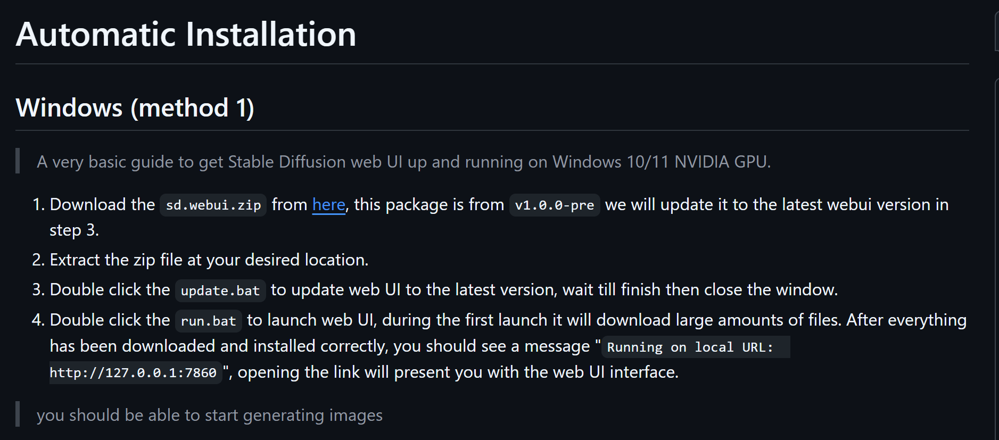
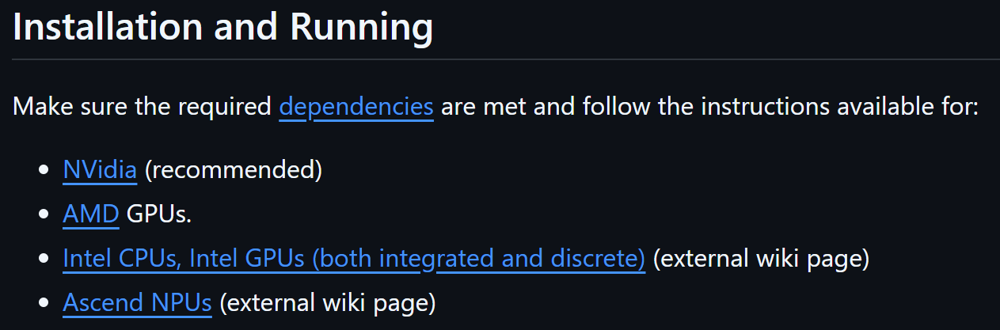

# Table of Contents
[Back to Main Project README](../README.md)
- [Database](#database)
  - [Oracle 23ai](#oracle-23ai)
- [Server](#server)
  - [Temporal](#temporal)
  - [Spark](#spark)
- [AI](#ai)
  - [Stable Diffusion](#stable-diffusion)
# Database
## Oracle 23ai
Reference:  
  * https://www.oracle.com/cn/database/technologies/oracle-database-software-downloads.html

1. Pull the Oracle 23ai Docker Image  
     Run the below command in terminal.
     ```text
     docker pull container-registry.oracle.com/database/free:23c
     ```
    "Oracle 23ai" is essentially the same database as "Oracle 23c" but with a name change to emphasize the significant focus on Artificial Intelligence (AI) features included in this release.
2. Run the Oracle 23ai Container
    ```text
    docker run -d --name oracle23c-ai \
    -p 1521:1521 -p 5500:5500 \
    -e ORACLE_PWD=<your-password>> \
    container-registry.oracle.com/database/free:23c
    ```
    `ORACLE_PWD` is an environment variable used to set the initial password for the default administrative users (SYS, SYSTEM, and other privileged accounts)
3. Open a terminal session inside the container
    ```text
    docker exec -it <container-name-or-id>  bash
    ```
# Server
## Temporal
1. Prerequisites
    * Docker: Ensure Docker is installed and running.
    * Docker Compose: Make sure you have Docker Compose installed.
2. Download and Modify the Official Temporal Docker Compose File
    ```text
    git clone https://github.com/temporalio/docker-compose.git
    cd docker-compose
    ```
    Modify the docker-compose.yml file to adjust the temporal server port and avoid port conflicts:
    ```yaml
    temporal-ui:
    container_name: temporal-ui
    depends_on:
      - temporal
    environment:
      - TEMPORAL_ADDRESS=temporal:7233
      - TEMPORAL_CORS_ORIGINS=http://localhost:3000
    image: temporalio/ui:${TEMPORAL_UI_VERSION}
    networks:
      - temporal-network
    ports:
      - <ui-port>:8080
    ```
   Replace `<ui-port>` with your ui port.
3. Start the Temporal Server  
   Run the following command to start all required services:
   ```text
    docker-compose up
    ```
4. Access the Temporal Web UI  
   Once the server is running, access the Temporal Web UI in your browser:
    ```text
    http://localhost:<your-ui-port>
    ```
## Spark
1. Prerequisites
   * Docker: Ensure Docker is installed and running.
   * Docker Compose: Make sure you have Docker Compose installed.
2. Setup Spark Server using Docker Compose
   Create a docker-compose.yml file
   ```yaml 
   version: '3.8'
   services:
     spark-master:
       image: bitnami/spark:latest
       container_name: spark-master
       hostname: spark-master
       networks:
         - spark-network
       ports:
         - "<ui-port>:8080"
         - "7077:7077"
       command: bash -c "/opt/bitnami/scripts/spark/run.sh && /opt/bitnami/spark/bin/spark-class org.apache.spark.deploy.master.Master"

     spark-worker:
       image: bitnami/spark:latest
       depends_on:
         - spark-master
       networks:
         - spark-network
       environment:
         - SPARK_MASTER_URL=spark://spark-master:7077
       command: bash -c "/opt/bitnami/scripts/spark/run.sh && /opt/bitnami/spark/bin/spark-class org.apache.spark.deploy.worker.Worker spark://spark-master:7077"

   networks:
     spark-network:
       driver: bridge
   ```
   Replace `<ui-port>` with your ui port to avoid port conflicts.
# AI
## Stable Diffusion
1. Visit the project repository
   https://github.com/AUTOMATIC1111/stable-diffusion-webui
2. Choose your GPU
   
3. Download the zip file and refer to the included instructions for installation.
   