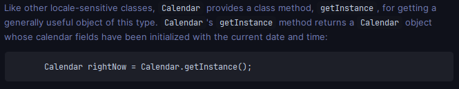

# Table of Contents
[Back to Main Project README](../README.md)
- [Code Structure](#code-structure)
  - [Interface](#interface-)
  - [Static Inner Class](#static-inner-class)
- [Development Standards](#development-standards)
  - [Git Commit Type](#git-commit-type)
  - [Comment](#comment)
# Code Structure
## Interface 
* [org.springframework.boot.Banner](https://github.com/spring-projects/spring-boot/blob/main/spring-boot-project/spring-boot/src/main/java/org/springframework/boot/Banner.java)
## Static Inner Class
* [org.springframework.web.util.UriComponentsBuilder](https://github.com/spring-projects/spring-framework/blob/main/spring-web/src/main/java/org/springframework/web/util/UriComponentsBuilder.java)
# Development Standards
## Git Commit Type
<table>
<thead>
<tr>
    <th>Commit Type</th>
    <th>Description</th>
    <th>Example</th>
</tr>
</thead>
<tbody>
<tr>
    <td>feat (Feature)</td>
    <td>Represents a new feature or functionality being added to the product. These are typically significant user-facing changes.</td>
    <td>Implement user login functionality.</td>
</tr>
<tr>
    <td>fix</td>
    <td>Refers to a bug fix. These changes resolve issues or defects found in the code or system.</td>
    <td>Fix broken navigation links on the homepage.</td>
</tr>
<tr>
    <td>docs (Documentation)</td>
    <td>Involves adding or updating documentation, whether it’s for the codebase, APIs, or user guides.</td>
    <td>Update API documentation for new endpoints.</td>
</tr>
<tr>
    <td>style</td>
    <td>Refers to changes that do not affect the logic or functionality of the code but improve its formatting, structure, or readability (e.g., code indentation, formatting, linting).</td>
    <td>Fix code indentation in Main.java.</td>
</tr>
<tr>
    <td>refactor</td>
    <td>Changes in the code to improve its internal structure without altering external behavior. These tasks aim to make the code more maintainable and cleaner.</td>
    <td>Refactor login service for better modularity.</td>
</tr>
<tr>
    <td>perf (Performance)</td>
    <td>Focuses on improving performance, such as optimizing algorithms or reducing resource usage.</td>
    <td>Optimize database query for faster response times.</td>
</tr>
<tr>
    <td>test</td>
    <td>Adding or updating tests to ensure the code works as expected. This category covers unit tests, integration tests, and other testing frameworks.</td>
    <td>Add unit tests for user authentication.</td>
</tr>
<tr>
    <td>build</td>
    <td>Changes related to the build system, dependencies, or build scripts (e.g., Maven, Gradle).</td>
    <td>Update Gradle build configuration.</td>
</tr>
<tr>
    <td>ci (Continuous Integration)</td>
    <td>Changes to CI/CD (Continuous Integration/Continuous Deployment) pipelines, such as updating build workflows or modifying test automation.</td>
    <td>Update CI pipeline to run additional test cases.</td>
</tr>
<tr>
    <td>chore</td>
    <td>Routine tasks that do not modify the production code directly but are necessary for project maintenance, such as updating dependencies or cleaning up the project.</td>
    <td>Upgrade project dependencies.</td>
</tr>
<tr>
    <td>revert</td>
    <td>Reverts a previous commit or change, effectively undoing it.</td>
    <td>Revert commit 123abc due to regression issues.</td>
</tr>
</tbody>
</table>

## Comment
### Javadoc tags
| **Tag**           | **Description**                                                                                     |
|--------------------|-----------------------------------------------------------------------------------------------------|
| `@author`          | Specifies the author(s) of a class or method.                                                       |
| `@version`         | Indicates the version of a class or method.                                                         |
| `@since`           | Specifies the version when a feature was added.                                                     |
| `@see`             | Creates a "see also" reference to other classes, methods, or fields.                                |
| `@param`           | Documents a method parameter.                                                                       |
| `@return`          | Describes the return value of a method.                                                             |
| `@throws` / `@exception` | Describes an exception thrown by a method.                                                    |
| `@deprecated`      | Marks a method, class, or field as deprecated.                                                      |
| `@inheritDoc`      | Inherits documentation from the immediate superclass or interface.                                  |
| `@link`            | Embeds a link to another class, method, or field.                                                   |
| `@linkplain`       | Same as `@link`, but renders text in plain text style.                                              |
| `{@value}`         | Displays the value of a constant in its documentation.                                              |
| `@docRoot`         | Specifies the relative path to the documentation root directory.                                    |
| `@serial`          | Documents a field of a serializable class.                                                          |
| `@serialField`     | Documents an `ObjectStreamField` component.                                                         |
| `@serialData`      | Describes data written by `writeObject()` or `writeExternal()`.                                     |
| `@literal`         | Displays text without interpreting it as HTML or Javadoc tags.                                      |
| `@code`            | Formats text as inline code.                                                                        |
| `@implNote`        | Adds implementation-specific notes.                                                                 |
| `@implSpec`        | Adds a description of the implementation specification.                                             |
| `@uses`            | Declares a dependency on a service provider.                                                        |
| `@provides`        | Indicates a service implementation provided by a module.                                            |
| `@hidden`          | Prevents inclusion of an element in the generated documentation.                                    |
| `@index`           | Adds an entry to the generated index with a custom label.                                           |
### Examples
#### java.util.Calendar

```text
 * <p>
 * Like other locale-sensitive classes, {@code Calendar} provides a
 * class method, {@code getInstance}, for getting a generally useful
 * object of this type. {@code Calendar}'s {@code getInstance} method
 * returns a {@code Calendar} object whose
 * calendar fields have been initialized with the current date and time:
 * <blockquote>
 * <pre>
 *     Calendar rightNow = Calendar.getInstance();
 * </pre>
 * </blockquote>
```